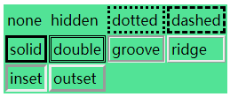

[TOC]


# CSS

CSS 用于控制网页的样式和布局。

CSS3 是最新的 CSS 标准。

## CSS 3模块

CSS3 被划分为模块。

其中最重要的 CSS3 模块包括：

- 选择器
- 框模型
- 背景和边框
- 文本效果
- 2D/3D 转换
- 动画
- 多列布局
- 用户界面

## 文本

| 属性                                                         | 描述                     |
| ------------------------------------------------------------ | ------------------------ |
| color     | 设置文本颜色             |
| direction | 设置文本方向。           |
| letter-spacing | 设置字符间距             |
| line-height | 设置行高                 |
| text-align | 对齐元素中的文本         |
| text-decoration | 向文本添加修饰           |
| text-indent | 缩进元素中文本的首行     |
| text-shadow | 设置文本阴影             |
| text-transform | 控制元素中的字母         |
| unicode-bidi | 设置或返回文本是否被重写 |
| vertical-align | 设置元素的垂直对齐       |
| white-space | 设置元素中空白的处理方式 |
| word-spacing | 设置字间距               |

## 盒模型


当用绝对的值设置盒子的大小时（比如，固定像素的 width 和 height），内容可能会超出设置的大小，此时内容就会溢流盒子。要控制这时候发生的事情，我们可以使用 `overflow` 属性。 该属性有几个可能的取值，不过最常用的是：

- `auto`：如果内容太多，那么溢流的内容会被隐藏，滚动条显示出来，从而可以让用户滚动看到所有内容。
- `hidden`：如果内容太多，那么溢流的内容被隐藏了。
- `visible`：如果内容太多，溢流的内容显示在盒子之外（这通常是默认的行为）。

### 设置宽和高的约束

其它一些属性可以用更灵活的方式控制内容盒的大小  —  是通过设置大小约束，而不是设置一个绝对大小。这是通过属性 [`min-width`](https://developer.mozilla.org/zh-CN/docs/Web/CSS/min-width)、[`max-width`](https://developer.mozilla.org/zh-CN/docs/Web/CSS/max-width)、[`min-height`](https://developer.mozilla.org/zh-CN/docs/Web/CSS/min-height) 和 [`max-height`](https://developer.mozilla.org/zh-CN/docs/Web/CSS/max-height) 实现的。

一个明显的用处是，如果想通过设置将一个布局的外层容器的宽度设置为百分比，从而让布局的宽度变得灵活，不过又不想让它变得太宽或者太窄，因为这样布局就开始看起来很糟糕。一个选择是用响应式网页设计技术，但是更简单的方法也许只是给布局一个最大和最小宽度约束即可：

```
width: 70%;
max-width: 1280px;
min-width: 480px;
```

您可以将这段代码与以下代码结合，可以将应用这段代码的容器在它的父容器内居中：

```
margin: 0 auto;
```

0会使顶部和底部边距为0，而auto（在这种情况下）共享父容器左右边距之间的可用空间使它居中。 最终的呈现的效果是：当父容器在最小和最大宽度限制内时，它将填满整个视口宽度；当父容器超过1280px宽度时，布局将保持在1280px宽，并开始在可用空间内居中。 当宽度低于480px时，视口将小于容器，您必须滚动才能看得到完全的内容。

## Filters（过滤器）

提供的图形特效，像模糊，锐化或元素变色。过滤器通常被用于调整图片，背景和边界的渲染。

使用CSS滤镜属性，你需要设定下面某一或多个函数的值。

- `url()`

  URL函数接受一个XML文件，该文件设置了 一个SVG滤镜，且可以包含一个锚点来指定一个具体的滤镜元素。

- `blur()`

- `brightness()`

- `contrast()`

- `drop-shadow()`

  给图像设置一个阴影效果。阴影是合成在图像下面，可以有模糊度的，可以以特定颜色画出的遮罩图的偏移版本。

- `grayscale()`

- `hue-rotate()`

- `invert()`

- `opacity()`

- `saturate()`

- `sepia()`

## Blend modes（混合模式）

这里有两个在 CSS中用到的属性:

- [`background-blend-mode`](https://developer.mozilla.org/zh-CN/docs/Web/CSS/background-blend-mode), 用来将单个元素的多重背景图片和背景颜色设置混合在一起。
- [`mix-blend-mode`](https://developer.mozilla.org/zh-CN/docs/Web/CSS/mix-blend-mode), 用来将一个元素与它覆盖的那些元素各自所设置的背景（background）和内容(content)混合在一起。

## Float（浮动）

float 属性有四个可能的值：

- `left` — 将元素浮动到左侧。
- `right` — 将元素浮动到右侧。
- `none` — 默认值, 不浮动。
- inherit — 继承父元素的浮动属性。

## Position（定位）

有四种主要的定位类型需要我们了解：

- **静态定位(Static positioning)**是每个元素默认的属性——它表示“将元素放在文档布局流的默认位置——没有什么特殊的地方”。
- **相对定位(Relative positioning)**允许我们相对元素在正常的文档流中的位置移动它——包括将两个元素叠放在页面上。这对于微调和精准设计(design pinpointing)非常有用。
- **绝对定位(Absolute positioning)**将元素完全从页面的正常布局流中移出，类似将它单独放在一个图层中. 我们可以将元素相对于页面的 `<html>` 元素边缘固定，或者相对于离元素最近的被定位的祖先元素(ancestor element)。绝对定位在创建复杂布局效果时非常有用，例如通过标签显示和隐藏的内容面板或者通过按钮控制滑动到屏幕中的信息面板.这意味着我们可以创建不干扰页面上其他元素的位置的隔离的UI功能 ——例如弹出信息框和控制菜单，翻转面板，可以在页面上的任何地方拖放的UI功能等。
- **固定定位(Fixed positioning)**与绝对定位非常类似，除了它是将一个元素相对浏览器视口固定，而不是相对另外一个元素。 在创建类似页面滚动总是处于页面上方的导航菜单时非常有用。

| 属性                                                         | 描述                                                         |
| ------------------------------------------------------------ | ------------------------------------------------------------ |
| [position](http://www.w3school.com.cn/cssref/pr_class_position.asp) | 把元素放置到一个静态的、相对的、绝对的、或固定的位置中。     |
| [top](http://www.w3school.com.cn/cssref/pr_pos_top.asp)      | 定义了一个定位元素的上外边距边界与其包含块上边界之间的偏移。 |
| [right](http://www.w3school.com.cn/cssref/pr_pos_right.asp)  | 定义了定位元素右外边距边界与其包含块右边界之间的偏移。       |
| [bottom](http://www.w3school.com.cn/cssref/pr_pos_bottom.asp) | 定义了定位元素下外边距边界与其包含块下边界之间的偏移。       |
| [left](http://www.w3school.com.cn/cssref/pr_pos_left.asp)    | 定义了定位元素左外边距边界与其包含块左边界之间的偏移。       |
| [overflow](http://www.w3school.com.cn/cssref/pr_pos_overflow.asp) | 设置当元素的内容溢出其区域时发生的事情。                     |
| [clip](http://www.w3school.com.cn/cssref/pr_pos_clip.asp)    | 设置元素的形状。元素被剪入这个形状之中，然后显示出来。       |
| [vertical-align](http://www.w3school.com.cn/cssref/pr_pos_vertical-align.asp) | 设置元素的垂直对齐方式。                                     |
| [z-index](http://www.w3school.com.cn/cssref/pr_pos_z-index.asp) | 设置元素的堆叠顺序。                                         |

## Display显示

**块级元素(block)特性：**

- 总是独占一行，表现为另起一行开始，而且其后的元素也必须另起一行显示;
- 宽度(width)、高度(height)、内边距(padding)和外边距(margin)都可控制;

**内联元素(inline)特性：**

- 和相邻的内联元素在同一行;
- 宽度(width)、高度(height)、内边距的top/bottom(padding-top/padding-bottom)和外边距的top/bottom(margin-top/margin-bottom)都不可改变，就是里面文字或图片的大小;

主要用的CSS样式有以下三个：

- display:block  -- 显示为块级元素
- display:inline  -- 显示为内联元素
- display:inline-block -- 显示为内联块元素，表现为同行显示并可修改宽高内外边距等属性

## Flex 模型


flex 规定了弹性元素如何伸长或缩短以适应flex容器中的可用空间。这是一个简写属性，可以同时设置 flex-grow, flex-shrink 与 flex-basis。

接受以下取值:

- `auto`

元素会根据自身的宽度与高度来确定尺寸，但是会自行伸长以吸收flex容器中额外的自由空间，也会缩短至自身最小尺寸以适应容器。这相当于将属性设置为 "`flex: 1 1 auto`".

- `initial`

属性默认值， 元素会根据自身宽高设置尺寸。它会缩短自身以适应容器，但不会伸长并吸收flex容器中的额外自由空间来适应容器 。相当于将属性设置为"`flex: 0 1 auto`"。

- `none`

元素会根据自身宽高来设置尺寸。它是完全非弹性的：既不会缩短，也不会伸长来适应flex容器。相当于将属性设置为"`flex: 0 0 auto`"。

- `<positive-number>`

元素会被赋予一个容器中自由空间的指定占比。这相当于设置属性为"`flex: <positive-number> 1 0`"。

### flex-basis

指定了 flex 元素在主轴方向上的初始大小。如果不使用 box-sizing 来改变盒模型的话，那么这个属性就决定了 flex 元素的内容盒（content-box）的宽或者高（取决于主轴的方向）的尺寸大小。

### flex-direction

属性指定了内部元素是如何在 flex 容器中布局的，定义了主轴的方向(正方向或反方向)。

接受以下取值:

- `row`

  flex容器的主轴被定义为与文本方向相同。 主轴起点和主轴终点与内容方向相同。

- `row-reverse`

  表现和row相同，但是置换了主轴起点和主轴终点

- `column`

  flex容器的主轴和块轴相同。主轴起点与主轴终点和书写模式的前后点相同

- `column-reverse`

  表现和`column`相同，但是置换了主轴起点和主轴终点

### flex-wrap

指定 flex 元素单行显示还是多行显示 。如果允许换行，这个属性允许你控制行的堆叠方向。

下面这些值是可以接受的:

- `nowrap`

  flex 的元素被摆放到到一行，这可能导致溢出 flex 容器。 **cross-start**  会根据 [`flex-direction`](https://developer.mozilla.org/zh-CN/docs/Web/CSS/flex-direction) 的值 相当于 **start** 或 **before**。

- `wrap`

  flex 元素 被打断到多个行中。**cross-start** 会根据 [`flex-direction`](https://developer.mozilla.org/zh-CN/docs/Web/CSS/flex-direction) 的值选择等于**start** 或**before**。**cross-end** 为确定的 **cross-start** 的另一端。

- `wrap-reverse`

  和 wrap 的行为一样，但是 **cross-start** 和 **cross-end** 互换。

### flex-flow

是 flex-direction 和 flex-wrap 的简写

### flex-grow

定义弹性盒子项（flex item）的拉伸因子。

- `<number>`

  参见[`<number>`](https://developer.mozilla.org/zh-CN/docs/Web/CSS/number)。负值无效。

### flex-shrink

指定了 flex 元素的收缩规则。flex 元素仅在默认宽度之和大于容器的时候才会发生收缩，其收缩的大小是依据 flex-shrink 的值。

- `<number>`

  参见[`<number>`](https://developer.mozilla.org/zh-CN/docs/Web/CSS/number)。负值无效。

## Font

### font-kerning

### font-size-adjust

### font-stretch

### font-synthesis

### font-variant

## Grid

### grid-area

一种对于 `grid-row-start`、`grid-column-start`、`grid-row-end `和`grid-column-end` 的简写，通过基线（line），跨度（span）或没有（自动）的网格放置在 `grid row` 中指定一个网格项的大小和位置，继而确定 `grid area` 的边界。

### grid-auto-columns

### grid-auto-flow

通过控制自动布局算法的运作原理，精确指定自动布局的元素在网格中排列的方向。

### grid-auto-rows

### grid-column

### grid-column-end

### grid-column-gap

### grid-column-start

### grid-gap

### grid-row

### grid-row-end

### grid-row-gap

### grid-row-start

### grid-template

用于定义 grid columns, rows 和areas

### grid-template-areas

### grid-template-columns

### grid-template-rows

## Border

### border-style

取值：

- none

  和关键字 hidden 类似，不显示边框。在这种情况下，如果没有设定背景图片，border-width 计算后的值将是 0，即使先前已经指定过它的值。在单元格边框重叠情况下，none 值优先级最低，意味着如果存在其他的重叠边框，则会显示为那个边框。

- hidden

  和关键字 none 类似，不显示边框。在这种情况下，如果没有设定背景图片，border-width 计算后的值将是 0，即使先前已经指定过它的值。在单元格边框重叠情况下，hidden 值优先级最高，意味着如果存在其他的重叠边框，边框不会显示。

- dotted

  显示为一系列圆点。标准中没有定义两点之间的间隔大小，视不同实现而定。圆点半径是 border-width 计算值的一半。

- dashed

  显示为一系列短的方形虚线。标准中没有定义线段的长度和大小，视不同实现而定。

- solid

  显示为一条实线。

- double

  显示为一条双实线，宽度是 border-width 。

- groove

  显示为有雕刻效果的边框，样式与 ridge 相反。

- ridge

  显示为有浮雕效果的边框，样式与 groove 相反。

- inset

  显示为有陷入效果的边框，样式与 outset 相反。当它指定到 border-collapse 为 collapsed 的单元格时，会显示为 groove 的样式。

- outset

  显示为有突出效果的边框，样式与 inset 相反。当它指定到 border-collapse 为 collapsed 的单元格时，会显示为 ridge 的样式。		



### border-image

CSS属性允许在元素的边框上绘制图像。这使得绘制复杂的外观组件更加简单，也不用在某些情况下使用九宫格了。使用 border-image 时，其将会替换掉 border-style 属性所设置的边框样式。

## box-sizing

用于更改用于计算元素宽度和高度的默认的 CSS 盒子模型。可以使用此属性来模拟不正确支持CSS盒子模型规范的浏览器的行为。

取值：

- `content-box`

默认值，标准盒子模型。 `width`与 `height`只包括内容的宽和高， 不包括边框（border），内边距（padding），外边距（margin）。注意: 内边距, 边框 & 外边距 都在这个盒子的外部。 比如. 如果 .box {width: 350px}; 而且 {border: 10px solid black;} 那么在浏览器中的渲染的实际宽度将是370px;
尺寸计算公式：width = 内容的宽度，height = 内容的高度。宽度和高度都不包含内容的边框（border）和内边距（padding）。

- `border-box`

 `width` 和 `height`属性包括内容，内边距和边框，但不包括外边距。这是当文档处于 Quirks模式 时Internet Explorer使用的盒模型。注意，填充和边框将在盒子内 , 例如, `.box {width: 350px; border: 10px solid black;} `导致在浏览器中呈现的宽度为350px的盒子。内容框不能为负，并且被分配到0，使得不可能使用border-box使元素消失。
这里的维度计算为：

`width = border + padding + 内容的  width`，

`height = border + padding + 内容的 height`。

## 对齐

要水平居中对齐一个元素, 可以使用 margin: auto;。

设置到元素的宽度将防止它溢出到容器的边缘。

元素通过指定宽度，并将两边的空外边距平均分配：

如果没有设置 width 属性(或者设置 100%)，居中对齐将不起作用。

## 排列

### align-content

定义了当作为一个弹性盒子容器的属性时，浏览器如何在容器的侧轴围绕弹性盒子项目分配空间。

取值：

- start
- flex-start
- flex-end
- center
- left
- right
- space-between
- space-around
- space-evenly
- stretch
- safe

### align-items

与justify-content相同的方式在侧轴方向上将当前行上的弹性元素对齐。

与align-content属性的区别在于它指定了当前Flex容器的行中的项目的对齐方式，而align-content则指定了行自身的对齐方式。

### align-self

对齐当前 flex 行中的 flex 元素，并覆盖 align-items 的值. 如果任何 flex 元素的侧轴方向 margin 值设置为 auto，则会忽略 align-self。

取值：

- auto

  设置为父元素的 align-items 值，如果该元素没有父元素的话，就设置为 stretch。

- flex-start

  flex 元素会对齐到 cross-axis 的首端。

- flex-end

  flex 元素会对齐到 cross-axis 的尾端。

- center

  flex 元素会对齐到 cross-axis 的中间，如果该元素的 cross-size 的尺寸大于 flex 容器，将在两个方向均等溢出。

- baseline

  所有的 flex 元素会沿着基线对齐，The item with the largest distance between its cross-start margin edge and its baseline is flushed with the cross-start edge of the line。

- stretch

  flex 元素将会基于容器的宽和高，按照自身 margin box 的 cross-size 拉伸。

### justify-content

定义了浏览器如何分配顺着父容器主轴的弹性元素之间及其周围的空间。

取值：

- start
- flex-start
- flex-end
- center
- left
- right
- space-between
- space-around
- space-evenly
- stretch
- safe

## 前缀

### **CSS3中-MS-,-MOZ-,-WEBKIT-,-O-浏览器私有前缀详解**

(1)-moz-：代表FireFox浏览器私有属性

(2)-ms-：代表IE浏览器私有属性

(3)-webkit-：代表safari、chrome浏览器私有属性

(4)-o-：代表opera浏览器私有属性

## Reference

1. [CSS教程](http://www.w3school.com.cn/css3/index.asp)