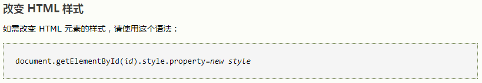

# JavaScript

[TOC]


## JavaScript语法规范

### JavaScript 书写位置

1. 与css类似，直接嵌入到html页面中.

   

2. 文件调用：JavaScript代码写到另一个文件当中（其后缀通常为“.js”），然后用格式

   `<scriptsrc="javascript.js"></script>`为的标记把它嵌入到文档中.


html页面中出现 `<script>` 标签后，就会让页面暂停等待脚本的解析和执行。无论当前脚本是内嵌式还是外链式，页面的下载和渲染都必须停下来等待脚本的执行完成才能继续，这在页面的生命周期中是必须的。

###  JavaScript 网页中输出信息写法

1. alert()，在网页中弹出提示框，显示信息。
2. console.log()，在控制台输出消息，一般用来调试程序。
3. prompt()，在网页中弹出输入框，一般用来接收用户输入信息。
4. confirm()，在网页中弹出提示框，显示信息，该方法一般与if 判断语句结合使用。
5. document.write()，直接在页面中输出信息。

### 声明变量（定义变量）  var

变量定义：   var   自定义名称;

### 声明变量 let

关键字let有4种使用方式：

- 可以作为变量声明，和var一样
- 在for或for/in循环中，作为var的替代方案
- 在语句中定义一个新变量并显示指定它的作用域
- 定义一个在表达式内部作用域中的变量，这个变量只在表达式内可用。

**命名规范：**

- 变量名必须以字符或下划线“_”开头
- 变量可以包含数字、从A至Z的大小字母
- JavaScript严格区分大小写，computer和Computer是两个完全不同的变量
- 禁止使用JavaScript的保留关键字作为变量名


### JavaScript中数据类型

#### 简单数据类型：

- Number:数字类型
- String:字符串类型
- Boolean:布尔类型
- undefined:变量未初始化
- null：空类型

#### null，undefined 的区别？

```
null 		表示一个对象是“没有值”的值，也就是值为“空”；
undefined 	表示一个变量声明了没有初始化(赋值)；

undefined不是一个有效的JSON，而null是；
undefined的类型(typeof)是undefined；
null的类型(typeof)是object；

Javascript将未赋值的变量默认值设为undefined；
Javascript从来不会将变量设为null。它是用来让程序员表明某个用var声明的变量时没有值的。
```

#### 复杂数据类型：

- Object:对象（引用）
- Array:数组

**NaN**:  Not  a Number      表示不是一个数字，判断是不是一个数字使用：   isNaN(x)

**Infinity**：无穷大          例如： var   number=7/0 ;

#### 不可变的原始值和可变的对象引用

JavaScript的原始值（undefined，null，布尔值、数字和字符串）是不可更改的。

```
var s="hello";
s.toUpperCase();//返回HELLO，但并没有改变s的值
```

对象和原始值不同，它们的值是可修改的。

#### 类型转换

```javascript
var a="3.14";
var b=a-2;//输出b等于1.14
var c=a+2;//输出c等于3.142
```

- 对于减号运算符，因为字符串不支持减法运算，所以系统自动将字符串转换成数值，对于包含其他字符的字符的字符串，将转换成NaN。
- 对于加号运算符，因为字符串可用加号作为连接运算符，所以系统自动将数值转换成字符串。


JavaScript 提供了如下几个函数来执行强制类型转换：

- toString():将布尔值、数值等转换成字符串
- parseInt():将字符串、布尔值等转换成整数
- parseFloat():将字符串、布尔值等转换成浮点数

#### 字符串类型

JavaScript 的字符串必须用引号括起来，可以是单引号，也可以是双引号。有如下基本方法和属性操作字符串。

- String()：可以构建一个字符串
- charAt()：获取字符串特定索引处的字符
- charCodeAt()：返回字符串中特定索引处的字符所对应的Unicode的值
- length：返回字符串长度
- toUpperCase()：转换成大写字母
- toLowerCase()：转换成小写字母
- fromCharCode()：将一系列Unicode值转换成字符串
- indexOf()：返回字符串中特定字符串第一次出现的位置
- lastIndexOf()：返回字符串中特定字符串最后一次出现的位置
- substring()：返回字符串的某个子串
- slice()：返回字符串的某个子串，功能比substring更强大支持负数参数
- match()：使用正则表达式搜索目标子字符串
- search()：使用正则表达式搜索目标子字符串
- concat()：用于将多个字符串拼加成一个字符串
- split()：将某个字符串分隔成多个字符串，可以指定分隔符
- replace()：将字符串中某个子串以特定字符串替代

#### typeof和instanceof运算符

typeof用于判断某个变量的数据类型，instanceof用于判断某个变量是否为指定类的实例


#### 声明提前（hoisting）

JavaScript 的变量作用域以函数为边界。声明提前指函数里声明的所有变量（但不涉及赋值）被提前至函数体的顶部。

应该尽可能将 var 类型的变量声明放在函数顶部，而不是靠近使用变量的地方。

#### 作用域链

### JavaScript严格模式

使用“use strict”指令的目的是说明（脚本或函数中）后续的代码将会解析为严格代码。

- 在严格模式中禁止使用with语句。
- 所有的变量都要先声明。
- 调用的函数（不是方法）中的一个this值是undefined。
- 当通过call（）或apply（）来调用函数时，其中的this值就是通过call（）或apply（）传入的第一个参数。
- 传入eval（）的代码不能在调用程序所在的上下文中声明变量或定义函数。
- 当delete运算符后跟随非法的标识符时，将会抛出一个语法异常。

### 语句

#### 语句块

```javascript
{
  x=Math.PI;
}
```

JavaScript要求所有的语句都以分号结束，但语句块不需要以分号结束，且语句块中每个语句都需要以分号结束。

#### 异常抛出语句

`throw new Error(errorString);`

```html
<!DOCTYPE html>
<html>
<body>

<script>
function myFunction()
{
try
{ 
var x=document.getElementById("demo").value;
if(x=="")    throw "值为空";
if(isNaN(x)) throw "不是数字";
if(x>10)     throw "太大";
if(x<5)      throw "太小";
}
catch(err)
{
var y=document.getElementById("mess");
y.innerHTML="错误：" + err + "。";
}
}
</script>

<h1>我的第一个 JavaScript 程序</h1>
<p>请输入 5 到 10 之间的数字：</p>
<input id="demo" type="text">
<button type="button" onclick="myFunction()">测试输入值</button>
<p id="mess"></p>

</body>
</html>
```

#### 异常捕捉语句

```javascript
try
{
  statements
}
catch(e)
{
  statements
}
finally
{
  statements
}
```

```html
<!DOCTYPE html>
<html>
<head>
<script>
var txt="";
function message()
{
try
  {
  adddlert("Welcome guest!");
  }
catch(err)
  {
  txt="本页有一个错误。\n\n";
  txt+="错误描述：" + err.message + "\n\n";
  txt+="点击确定继续。\n\n";
  alert(txt);
  }
}
</script>
</head>

<body>
<input type="button" value="查看消息" onclick="message()" />
</body>

</html>

```

#### with 语句

用于临时扩展作用域链。

```javascript
这条语句将object添加到作用域链的头部，然后执行statement，最后把作用域链恢复到原始状态。
with(object)
{
  statements
}
with(document)
{
  writeln("a");
  writeln("b");
  writeln("c");
}
```

可以避免重复书写对象。


#### for in 循环

```javascript
for (index in object)
{
  
}

var person={fname:"John",lname:"Doe",age:25};
for (x in person)
  {
  txt=txt + person[x];
  }
```

它主要有两个作用：

- 遍历数组里的所有数组元素
- 遍历JavaScript对象的所有属性

### 函数

#### 定义命名函数

```javascript
function functionName(parameter list)
{
  statements
}
```

定义匿名函数

```javascript
function (parameter list)
{
  statements
};
```

实际上就是定义了一个函数对象，接下来可以将这个对象赋给另一个变量，然后就可以通过这个变量来调用这个匿名函数。

#### 使用Function类匿名函数

```javascript
var f=new Function('name',"document.writeln('Function定义的函数<br>');"+"document.writeln('你好'+name);");
f("yeefu");
```

当定义一个函数后，实际上得到如下4项

- 函数：就像Java的方法一样，这个函数可以被调用
- 对象：定义一个函数时，系统也会创建一个对象，该对象时Function类的实例
- 方法：定义一个函数时，该函数通常都会附加给某个对象，作为该对象的方法
- 类：在定义函数时，也得到一个与函数同名的类。

因此，当我们定义一个函数时，有如下方式来调用函数：

- 直接调用函数：返回调用函数总是返回该函数体内最后一条return语句的返回值；如果该函数体内不包含return语句，则直接调用函数没有任何返回值。
- 使用new关键字调用函数，通过这种方式调用总有一个返回值，返回值就是一个JavaScript对象。

```javascript
var test=function(name)
{
    return "你好，"+name;
}
var rval=test('lee');//输出rval为你好，lee
var obj=new test('lee');//输出obj为[object Object]

function Person(name,age)
{
    this.name=name;
  	this.age=age;
  	this.info=function()
    {
        document.writeln(this.name);
      	document.writeln(this.age);
    };
}
var p=new Person('lee',24);
p.info();

var hello=function(name)
{
    document.write(name);
}
window.hello("lee");
var p={
    walk:function()
  	{
      for(var i=0;i<2;i++)
        documnet.write("slow");
  	}
}
p.walk();
```

- 以call()方法调用函数

```javascript
/*有些时候调用函数时需要动态传入一个函数引用，此时为了动态地调用函数，就需要使用call方法来调用函数了。
假如定义一个形如each（array,fn)的函数，这个函数可以自动迭代处理array数组元素，而fn函数则负责对数组元素进行处理，此时需要在each函数中调用fn函数，但目前fn函数并未确定，因此无法采用直接调用方法来调用fn函数，此时可以通过call()方法来调用函数。*/
var each=function(array,fn)
{
    for(var index in array)
      {
          fn.call(null,index,array[index]);
      }
}
//调用each函数，第一个参数是数组，第二个参数是函数
each([4,20,3],function(index,ele)
    {
    document.write(index+ele);
})
```

- 以apply()方法调用函数

通过call调用函数时，必须在括号中详细地列出每个参数，通过apply()动态调用函数时，可以在括号里以arguments来代表所有参数。

```javascript
var myfun=function(a,b)
{
  alert(a+b);
}
myfun.call(window,12,23);
var example=function(num1,num2)
{
  myfun.apply(this,arguments);
}
example(20,40);
myfun.apply(window,[12,23]);
```


### 闭包

ECMAScript中，闭包指的是：

1. 从理论角度：所有的函数。因为它们都在创建的时候就将上层上下文的数据保存起来了。哪怕是简单的全局变量也是如此，因为函数中访问全局变量就相当于是在访问自由变量，这个时候使用最外层的作用域。
2. 从实践角度：以下函数才算是闭包：
   - 即使创建它的上下文已经销毁，它仍然存在（比如，内部函数从父函数中返回）

   - 在代码中引用了自由变量

闭包是指有权访问另一个函数作用域中变量的函数，创建闭包的最常见的方式就是在一个函数内创建另一个函数，通过另一个函数访问这个函数的局部变量,利用闭包可以突破作用链域，将函数内部的变量和方法传递到外部。

闭包的特性：

1. 函数内再嵌套函数
2. 内部函数可以引用外层的参数和变量
3. 参数和变量不会被垃圾回收机制回收

```javascript
var data = [];

for (var i = 0; i < 3; i++) {
  data[i] = function () {
    console.log(i);
  };
}

data[0]();
data[1]();
data[2]();

答案是都是 3，让我们分析一下原因：

当执行到 data[0] 函数之前，此时全局上下文的 VO 为：

globalContext = {
    VO: {
        data: [...],
        i: 3
    }
}
当执行 data[0] 函数的时候，data[0] 函数的作用域链为：

data[0]Context = {
    Scope: [AO, globalContext.VO]
}
data[0]Context 的 AO 并没有 i 值，所以会从 globalContext.VO 中查找，i 为 3，所以打印的结果就是 3。

data[1] 和 data[2] 是一样的道理。

所以让我们改成闭包看看：

var data = [];

for (var i = 0; i < 3; i++) {
  data[i] = (function (i) {
        return function(){
            console.log(i);
        }
  })(i);
}

data[0]();
data[1]();
data[2]();
当执行到 data[0] 函数之前，此时全局上下文的 VO 为：

globalContext = {
    VO: {
        data: [...],
        i: 3
    }
}
跟没改之前一模一样。

当执行 data[0] 函数的时候，data[0] 函数的作用域链发生了改变：

data[0]Context = {
    Scope: [AO, 匿名函数Context.AO globalContext.VO]
}
匿名函数执行上下文的AO为：

匿名函数Context = {
    AO: {
        arguments: {
            0: 0,
            length: 1
        },
        i: 0
    }
}
data[0]Context 的 AO 并没有 i 值，所以会沿着作用域链从匿名函数 Context.AO 中查找，这时候就会找 i 为 0，找到了就不会往 globalContext.VO 中查找了，即使 globalContext.VO 也有 i 的值(值为3)，所以打印的结果就是0。
```

### Ajax(Asychronous Javascript and XML)

Ajax 是一种异步请求数据的一种技术，主要用来实现客户端与服务器端的异步通信效果，实现页面的局部刷新，对于改善用户的体验和程序的性能很有帮助。

```javascript
(1)创建XMLHttpRequest对象,也就是创建一个异步调用对象
(2)创建一个新的HTTP请求,并指定该HTTP请求的方法、URL及验证信息
(3)设置响应HTTP请求状态变化的函数
(4)发送HTTP请求
(5)获取异步调用返回的数据
(6)使用JavaScript和DOM实现局部刷新
 
var xhr =null;//创建对象
if(window.XMLHttpRequest){
    xhr = new XMLHttpRequest();
}else{
    xhr = new ActiveXObject("Microsoft.XMLHTTP");
}
xhr.open(“方式”,”地址”,”标志位”);//初始化请求
xhr.setRequestHeader(“”,””);//设置http头信息
xhr.onreadystatechange =function(){}//指定回调函数
xhr.send();//发送请求

readyState状态值一共有5种状态，从0 到 4 发生变化。
0: 请求未初始化
1: 服务器连接已建立
2: 请求已接收
3: 请求处理中
4: 请求已完成，且响应已就绪

xmlhttp.status：响应状态码。这个也是面试比较爱问的，这个必须知道4个以上，比较常见的有：
200: "OK"
403  （禁止） 		   服务器拒绝请求。
404  （未找到） 		  服务器找不到请求的网页。
408  （请求超时） 	  服务器等候请求时发生超时。
500  （服务器内部错误）  服务器遇到错误，无法完成请求
```

Ajax 解决浏览器缓存问题？

```
1、在ajax发送请求前加上 anyAjaxObj.setRequestHeader("If-Modified-Since","0")。
2、在ajax发送请求前加上 anyAjaxObj.setRequestHeader("Cache-Control","no-cache")。
3、在URL后面加上一个随机数： "fresh=" + Math.random();。
4、在URL后面加上时间戳："nowtime=" + new Date().getTime();。
5、如果是使用jQuery，直接这样就可以了 $.ajaxSetup({cache:false})。这样页面的所有ajax都会执行这条语句就是不需要保存缓存记录。
```

### jQuery


### 创建对象

#### 使用new关键字调用构造器创建对象，`var p=new Person();`

#### 使用Object直接创建对象，`var myobj=new Object();`

#### 使用JSON语法创建对象

```javascript
object={
  Name:Value,
  Name:Value,
  ...
}
```


```html
<!--使用对象构造器,本例使用函数来构造对象;-->
<!DOCTYPE html>
<html>
<body>

<script>
function person(firstname,lastname,age,eyecolor)
{
this.firstname=firstname;
this.lastname=lastname;
this.age=age;
this.eyecolor=eyecolor;
}

myFather=new person("Bill","Gates",56,"blue");

document.write(myFather.firstname + " is " + myFather.age + " years old.");
</script>

</body>
</html>
```

#### 关键字this


#### 原型

每一个JavaScript对象（null除外）都和另一个对象相关联。另一个对象就是我们熟知的原型，每一个对象都从原型继承属性。比如通过new Array（）创建的对象的原型就是Array.prototype。


现在就更像创建一般对象了。所有的非函数属性都在构造函数中创建，意味着又能够用构造函数的参数赋予属性默认值了。因为只创建 showColor() 函数的一个实例，所以没有内存浪费。此外，给 oCar1 的 drivers 数组添加 "Bill" 值，不会影响到 oCar2 的数组，所以输出这些数组的值时，oCar1.drivers 显示的是 "Mike,John,Bill"，而 oCar2.drivers 显示的是 "Mike,John"。因为使用了原型方式，所以仍然能利用 instanceof 运算符来判断对象的类型。

这种方式是 ECMAScript 采用的主要方式，它具有其他方式的特性，却没有他们的副作用。不过，有些开发者仍觉得这种方法不够完美。

#### **动态原型方法**


直到检查 `typeof Car._initialized` 是否等于 "undefined" 之前，这个构造函数都未发生变化。这行代码是动态原型方法中最重要的部分。如果这个值未定义，构造函数将用原型方式继续定义对象的方法，然后把 `Car._initialized` 设置为 true。如果这个值定义了（它的值为 true 时，typeof 的值为 Boolean），那么就不再创建该方法。简而言之，该方法使用标志（_initialized）来判断是否已给原型赋予了任何方法。该方法只创建并赋值一次，传统的 OOP 开发者会高兴地发现，这段代码看起来更像其他语言中的类定义了。

#### **重定义已有方法**


在这段代码中，第一行代码把对当前 toString() 方法的引用保存在属性 originalToString 中。然后用定制的方法覆盖了 toString() 方法。新方法将检查该函数源代码的长度是否大于 100。如果是，就返回错误信息，说明该函数代码太长，否则调用 originalToString() 方法，返回函数的源代码。


#### 对象冒充


#### call()和apply（）方法


#### bind（）方法


#### 原型链


### 函数式编程


### w3school 学习笔记

#### JavaScript：改变 HTML 图像

```html
<!DOCTYPE html>
<html>
<body>
<script>
function changeImage()
{
element=document.getElementById('myimage')
if (element.src.match("bulbon"))
  {
  element.src="/i/eg_bulboff.gif";
  }
else
  {
  element.src="/i/eg_bulbon.gif";
  }
}
</script>


<p>点击灯泡来点亮或熄灭这盏灯</p>

</body>
</html>
```


### JavaScript HTML DOM

通过可编程的对象模型，JavaScript 获得了足够的能力来创建动态的 HTML。

- JavaScript 能够改变页面中的所有 HTML 元素
- JavaScript 能够改变页面中的所有 HTML 属性
- JavaScript 能够改变页面中的所有 CSS 样式
- JavaScript 能够对页面中的所有事件做出反应

#### 查找 HTML 元素

通常，通过 JavaScript，您需要操作 HTML 元素。

为了做到这件事情，您必须首先找到该元素。有三种方法来做这件事：

- 通过 id 找到 HTML 元素
- 通过标签名找到 HTML 元素
- 通过类名找到 HTML 元素




## 面试总结

- JavaScript有几种类型的值？

- ```
  栈：原始数据类型（Undefined，Null，Boolean，Number、String）
  堆：引用数据类型（对象、数组和函数）
  
  两种类型的区别是：存储位置不同；
  原始数据类型直接存储在栈(stack)中的简单数据段，占据空间小、大小固定，属于被频繁使用数据，所以放入栈中存储；
  引用数据类型存储在堆(heap)中的对象,占据空间大、大小不固定。如果存储在栈中，将会影响程序运行的性能；引用数据类型在栈中存储了指针，该指针指向堆中该实体的起始地址。当解释器寻找引用值时，会首先检索其在栈中的地址，取得地址后从堆中获得实体
  ```

  如何将浮点数点左边的数每三位添加一个逗号，如12000000.11转化为12,000,000.11?

  ```javascript
   function commafy(num){
    	return num && num
    		.toString()
    		.replace(/(\d)(?=(\d{3})+\.)/g, function($1, $2){
    			return $2 + ',';
    		});
    }
  ```

- Javascript作用链域?

  ```
  全局函数无法查看局部函数的内部细节，但局部函数可以查看其上层的函数细节，直至全局细节。当需要从局部函数查找某一属性或方法时，如果当前作用域没有找到，就会上溯到上层作用域查找，直至全局函数，这种组织形式就是作用域链。
  ```

- 如何解决跨域问题?

```
所谓同源是指，域名，协议，端口均相同，跨域则是其中一个或多个不同。
http://www.123.com/index.html 调用 http://www.123.com/server.PHP （非跨域）
http://www.123.com/index.html 调用 http://www.456.com/server.php （主域名不同:123/456，跨域）
http://abc.123.com/index.html 调用 http://def.123.com/server.php （子域名不同:abc/def，跨域）
http://www.123.com:8080/index.html 调用 http://www.123.com:8081/server.php （端口不同:8080/8081，跨域）
http://www.123.com/index.html 调用 https://www.123.com/server.php （协议不同:http/https，跨域）
  
1、通过location.hash跨域
2、通过window.name跨域
3、通过window.postMessage跨域
4、通过JSONP跨域
5、通过WebSocket跨域
6、通过CORS跨域
```


## Reference

1. [JavaScript教程](http://www.w3school.com.cn/js/index.asp)
2. [定义类或对象](http://www.w3school.com.cn/js/pro_js_object_defining.asp)
3. [继承](http://www.w3school.com.cn/js/pro_js_inheritance_implementing.asp)