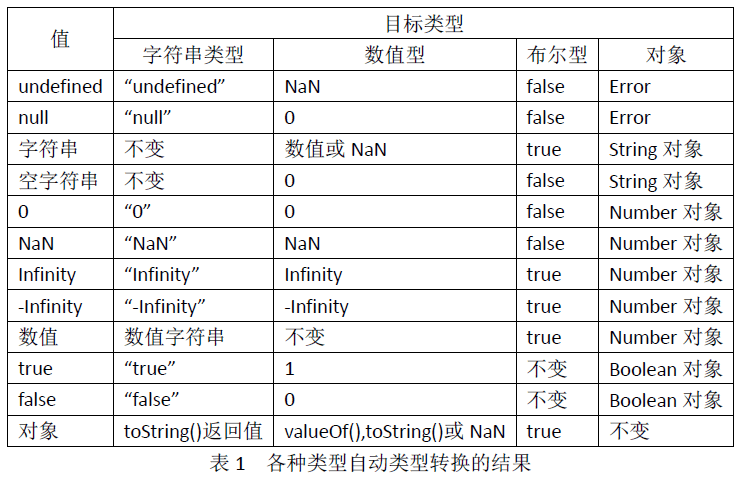

# 类型和值

## 原始类型

- 数字 : Number
- 字符串 : String
- 布尔值 : Boolean

- null : 空类型
- undefined : 变量未初始化

### null与undefined的区别

```javascript
null 		表示一个对象是“没有值”的值，也就是值为“空”；
undefined 	表示一个变量声明了没有初始化(赋值)；

undefined   不是一个有效的JSON，而null是；
typeof undefined 是undefined；
typeof null 是object；

Javascript 将未赋值的变量默认值设为 undefined；

null == undefined //true
null === undefined //false
```

## 对象类型

- Object:对象（引用）
- Array:数组

## 不可变的原始值和可变的对象引用

JavaScript的原始值（undefined，null，布尔值、数字和字符串）是不可更改的。

```
var s="hello";
s.toUpperCase();//返回HELLO，但并没有改变s的值
```

对象和原始值不同，它们的值是可修改的。

对象的比较并非值的比较：即使两个对象包含同样的属性及相同的值，它们也是不相等的。例如各个索引元素完成相等的两个数组也不一定相等。通常将JavaScript对象称为引用类型，对象值都是引用，对象的比较均是引用的比较，当且仅当它们的引用同一个基对象时，它们才相等。

```javascript
var o = {x:1},p = {x:1};	//
o === p						//false
var a = [], b = [];
a === b						//false
var c = a;
c[0] = 1;
a[0]						//1
a === c						//true
```

## 类型转换

### 隐式转换

```javascript
var a="3.14";
var b=a-2;//输出b等于1.14
var c=a+2;//输出c等于3.142
console.log(!a);//false
console.log(!!a);//true，等价于Boolean()
```

- 对于 “-” 运算符，因为字符串不支持减法运算，所以系统自动将字符串转换成数值，对于包含其他字符的字符的字符串，将转换成NaN。
- 对于 “+” 运算符，优先考虑字符串连接，如果其中一个操作数是字符串或者转换为字符串的对象，另外一个操作数将会转换为字符串。
- 对于 "!" 运算符，它将其操作数转换为布尔值并取反。
- 对于 "==" 、"!="、“<”以及其他关系运算符，也会做对象到原始值的转换，但要出去日期对象的特殊情形。



### 显示转换

做显示类型转换最简单的方法就是使用

- Boolean()
- Number()
- String()
- Object()

```javascript
Number("3")		//3
String(false)	//"false"
Boolean([])		//true
Object(3)		//new Number(3)
```

JavaScript 也提供了如下几个函数来执行强制类型转换：

- toString():将布尔值、数值等转换成字符串；
- parseInt():将字符串、布尔值等转换成整数；
- parseFloat():将字符串、布尔值等转换成浮点数；
- valueOf():将对象转换为表示它的原始值；

JavaScript中对象到字符串的转换经过如下这些步骤：

- 如果对象具有toString()方法，则调用这个方法。如果这个方法返回一个原始值，JavaScript就将这个值转换为字符串。
- 如果对象没有toString()方法，或者这个方法并不返回一个原始值，那么JavaScript就会调用valueOf()方法。如果存在这个方法，且返回值是原始值，JavaScript就会将这个值转换为字符串。
- 否则，它将抛出一个类型错误异常。

JavaScript中对象到数字的转换则经过如下这些步骤：

- 如果对象具有valueOf()方法，如果这个方法返回一个原始值，JavaScript就将这个值转换为数字。
- 否则，如果对象具有toString()方法，如果这个方法返回一个原始值，JavaScript就将这个值转换为数字。
- 否则，它将抛出一个类型错误异常。

# 变量

## 变量声明 var 和 let

```javascript
var sum;
var i=0,j=0,k=0;

//重复声明
var str="hello";
var str;	//变量str的值依然是hello

//遗漏
var trueVar=1;
fakeVar=2;	//创建全局对象的一个可删除属性
delete fakeVar;	//true，变量被删除
delete trueVar;	//false，变量并没有被删除
```

let 所声明的变量只在 let 所在的代码块内有效。

```javascript
{
    let a = 10;
    var b = 1;
}

a	//ReferenceError: a is not defined
b	//1
```

var 会发生变量提升现象，即变量可以在声明之前使用，值为 undefined。let 所声明的变量一定要在声明后使用，否则便会报错。

```javascript
console.log(a);	//输出 undefined
var a = 2;

console.log(b);	//ReferenceError
let b = 2;
```

只要块级作用域内存在 let 命令，它所声明的变量就绑定这个区域，不再受外部的影响，只要在声明之前使用这些变量，就会报错。

```javascript
var tmp = 123;
if(true){
    tmp = 'abc';	//ReferenceError
    let tmp;
}

function bar(x=y,y=2){
    return [x,y];
}
bar();	//报错
```

let 不允许在相同作用域内重复声明同一个变量。

```javascript
//报错
function（）｛
	let a = 10;
	var a = 1;
｝
//报错
function（）｛
	let a = 10;
	let a = 1;
｝
```

## 作用域链

每一段JavaScript代码都有一个与之关联的作用域链（scope chain）。这个作用域链是一个对象列表或者链表，这组对象定义了这段代码作用域中的变量。当JavaScript需要查找变量x的值的时候（这个过程叫做变量解析），它会从链中的第一个对象开始查找，如果第一个对象中不存在名为x的属性，JavaScript会继续查找链上的下一个对象。如果第二个对象依然没有名为x的属性，则会继续查找下一个对象，以此类推。如果作用域链上没有任何一个对象包含属性x，那么就认为这段代码的作用域链上不存在x，并最终抛出一个引用错误（ReferenceError）异常。

# 运算符

## “+”运算符

- 如果其中一个操作数是对象，则对象会遵循对象到原始值的转换规则转换为原始类值；
- 在进行了对象到原始值的转换后，如果其中一个操作数是字符串的话，另一个操作数也会转换为字符串，然后进行字符串连接；
- 否则，两个操作数都将转换为数字（或者NaN），然后进行加法操作。

## “>>”带符号右移

右边溢出的位将被忽略，填补在左边的位由原操作数的符号决定，一边保持结果的符号与原操作数一致。如果第一个操作数是正数，移位后用0填补最高位，否则用1填补高位。

## “>>>”无符号右移

左边的高位总是填补0.与原来的操作数符号无关。

```javascript
-1>>4=-1
-1>>>4=0x0fffffff
```

## ”===“严格相等运算符

比较过程没有任何类型转换：

- 如果其中一个值是NaN，或者两个值都是NaN，则它们不相等。可以通过`x!===x`来判断x是否为NaN，只有在x为NaN的时候，这个表达式的值才会为true。
- 如果两个引用值指向同一个对象、数组或函数，则它们是相等的。如果指向不同的对象，则它们是不等的，尽管两个对象具有完全一样的属性。
- 如果两个值为字符串，……两个字符串可能含义完全一样且所显示出的字符也一样，但具有不同编码的16位值（UTF-16）。JavaScript并不对Unicode进行标准化的转换。像这样的字符串通过”===“和”==“的比较结果也不相等。

## ”==“相等运算符

如果两个操作数不是同一类型，那么它会尝试进行一些类型转换，然后进行比较。

## 比较运算符

- 只有数字和字符串才能真正执行比较操作，因此其他操作数都将进行类型转换。
- 如果其中一个操作数（或转换后是）是NaN，那么比较操作符总是返回false。
- ”<=“和”>=“运算符在判断相等的时候，并不依赖于相等运算符和严格相等运算符的比较规则。

## ”in“运算符

它的左操作数是一个字符串或可以转换为字符串，右操作数是一个对象。如果右侧的对象拥有一个名为左操作数的属性名，那么表达式返回true。

```javascript
var point = {x:1,y:1};
"x" in point	//true
"z" in point	//false
"toString" in point		//true，对象继承了toString（）方法

var data = {7,8,9};
"0" in data		//true
1 in data		//true,数字转换为字符串
3 in data		//false，没有索引为3的元素
```

## ”&&“运算符

首先计算左操作数的值，如果计算结果是假值，那么整个表达式的结果一定也是假值，因此”&&“这时简单地返回左操作数的值，而且并不会对右操作数进行计算。

如果左操作数是真值，那么整个表达式的结果则依赖于右操作数的值。”&&“运算符会计算右操作数的值并将其返回作为这个表达式的计算结果。

## eval（）运算符

## delete运算符

## void运算符

# 语句

## switch 语句

JavaScript中的case表达式的值是在运行时计算的，这一点使得JavaScript的switch语句和C、C++和Java中的switch语句有很大区别，并且效率也很低。在C、C++和Java中，case表达式必须为同类型的编译时常量，而且switch语句通常会编译成一个跳转表，这让switch语句执行非常高效。JavaScript中的switch语句可以用于字符串，而且能用不是常量的值说明情况。

```javascript
var BLUE = "blue", RED = "red", GREEN  = "green";

switch (sColor) {
  case BLUE: alert("Blue");
    break;
  case RED: alert("Red");
    break;
  case GREEN: alert("Green");
    break;
  default: alert("Other");
}

//这里，switch 语句用于字符串 sColor，声明 case 使用的是变量 BLUE、RED 和 GREEN，这在JavaScript 中是完全有效的。
```

## for in 循环

```javascript
for (index in object)
{
  
}

var person={fname:"John",lname:"Doe",age:25};
for (x in person)
  {
  txt=txt + person[x];
  }
```

它主要有两个作用：

- 遍历数组里的所有数组元素
- 遍历JavaScript对象的所有属性

## with 语句

用于临时扩展作用域链，在严格模式中是禁止使用with语句的，并且在非严格模式下也是不推荐使用with语句的。那些使用with语句的JavaScript代码非常难于优化，并且同没有使用with语句的代码相比，它运行得更慢。

```javascript
//这条语句将object添加到作用域链的顶层，然后执行statement，最后把作用域链恢复到原始状态。
with(object)
{
  statements
}
//比如这样一条语句在代码中多处出现，
document.forms[0].address.value=" ";
//则可以使用with语句将form对象添加至作用域链的顶层
with(document.forms[0])
{
  address.value = " ";
}
//当然，不使用with语句的等价代码可以写成这样
var f = document.forms[0];
f.address.value = " ";
```

可以避免重复书写对象。

## debugger 语句

debugger语句通常什么也不做。然而，当调试程序可用并运行的时候，JavaScript解释器将会以调试模式运行。实际上，这条语句用来产生一个端点。

```javascript
function f(o){
    if(o===undefined) debugger;
}
```

## use strict 语句

使用use strict指令的目的是说明（脚本中或函数中）后续的代码将会解析为严格代码。

# 对象

## 创建对象

### 原始方式

```javascript
var oCar = new Object;
oCar.color = "blue";
oCar.doors = 4;
oCar.mpg = 25;
oCar.showColor = function() {
  alert(this.color);
};
//不过这里有一个问题，就是可能需要创建多个 car 的实例。
```

### 工厂方式

```javascript
function createCar(sColor,iDoors,iMpg) {
  var oTempCar = new Object;
  oTempCar.color = sColor;
  oTempCar.doors = iDoors;
  oTempCar.mpg = iMpg;
  oTempCar.showColor = function() {
    alert(this.color);
  };
  return oTempCar;
}

var oCar1 = createCar("red",4,23);
var oCar2 = createCar("blue",3,25);

oCar1.showColor();		//输出 "red"
oCar2.showColor();		//输出 "blue"
//每次调用函数 createCar()，都要创建新函数 showColor()，意味着每个对象都有自己的 showColor() 版本。而事实上，每个对象都共享同一个函数。
```

### 构造函数方式

```javascript
function Car(sColor,iDoors,iMpg) {
  this.color = sColor;
  this.doors = iDoors;
  this.mpg = iMpg;
  this.showColor = function() {
    alert(this.color);
  };
}

var oCar1 = new Car("red",4,23);
var oCar2 = new Car("blue",3,25);
//就像工厂函数，构造函数会重复生成函数，为每个对象都创建独立的函数版本。
```

### 原型方式

```javascript
function Car() {
}

Car.prototype.color = "blue";
Car.prototype.doors = 4;
Car.prototype.mpg = 25;
Car.prototype.showColor = function() {
  alert(this.color);
};

var oCar1 = new Car();
var oCar2 = new Car();
//调用 new Car() 时，原型的所有属性都被立即赋予要创建的对象，意味着所有 Car 实例存放的都是指向 showColor() 函数的指针。从语义上讲，所有属性看起来都属于一个对象，因此解决了前面两种方式存在的问题。
//使用这种方式，还能用 instanceof 运算符检查给定变量指向的对象的类型

//使用原型方式，不能通过给构造函数传递参数来初始化属性的值,这意味着必须在对象创建后才能改变属性的默认值。
```

```javascript
//原型方式的问题
function Car() {
}

Car.prototype.color = "blue";
Car.prototype.doors = 4;
Car.prototype.mpg = 25;
Car.prototype.drivers = new Array("Mike","John");
Car.prototype.showColor = function() {
  alert(this.color);
};

var oCar1 = new Car();
var oCar2 = new Car();

oCar1.drivers.push("Bill");

alert(oCar1.drivers);	//输出 "Mike,John,Bill"
alert(oCar2.drivers);	//输出 "Mike,John,Bill"
```

### 混合的构造函数/原型方式

```javascript
function Car(sColor,iDoors,iMpg) {
  this.color = sColor;
  this.doors = iDoors;
  this.mpg = iMpg;
  this.drivers = new Array("Mike","John");
}

Car.prototype.showColor = function() {
  alert(this.color);
};

var oCar1 = new Car("red",4,23);
var oCar2 = new Car("blue",3,25);

oCar1.drivers.push("Bill");

alert(oCar1.drivers);	//输出 "Mike,John,Bill"
alert(oCar2.drivers);	//输出 "Mike,John"
//用构造函数定义对象的所有非函数属性，用原型方式定义对象的函数属性（方法）。结果是，所有函数都只创建一次，而每个对象都具有自己的对象属性实例。
```

### 动态原型方法

```javascript
function Car(sColor,iDoors,iMpg) {
  this.color = sColor;
  this.doors = iDoors;
  this.mpg = iMpg;
  this.drivers = new Array("Mike","John");
  
  if (typeof Car._initialized == "undefined") {
    Car.prototype.showColor = function() {
      alert(this.color);
    };
	
    Car._initialized = true;
  }
}
//如果Car._initialized这个值未定义，构造函数将用原型方式继续定义对象的方法，然后把它设置为 true。如果这个值定义了（它的值为 true 时，typeof 的值为 Boolean），那么就不再创建该方法。
```

## 重定义对象已有方法

 Function 的 toString() 方法通常输出的是函数的源代码。覆盖该方法，可以返回另一个字符串（在这个例子中，可以返回 "Function code hidden"）。不过，toString() 指向的原始函数将被无用存储单元回收程序回收，因为它被完全废弃了。没有能够恢复原始函数的方法，所以在覆盖原始方法前，比较安全的做法是存储它的指针，以便以后的使用。有时你甚至可能在新方法中调用原始方法：

```javascript
Function.prototype.originalToString = Function.prototype.toString;

Function.prototype.toString = function() {
  if (this.originalToString().length > 100) {
    return "Function too long to display.";
  } else {
    return this.originalToString();
  }
};
```

## 极晚绑定

从技术上讲，根本不存在极晚绑定。该术语是指能够在对象实例化后再定义它的方法。例如：

```javascript
var o = new Object();

Object.prototype.sayHi = function () {
  alert("hi");
};

o.sayHi();
//不建议使用极晚绑定方法，因为很难对其跟踪和记录。不过，还是应该了解这种可能。
```

## 原型

每一个JavaScript对象（null除外）都和另一个对象相关联。另一个对象就是我们熟知的原型，每一个对象都从原型继承属性。比如通过new Array（）创建的对象的原型就是Array.prototype。

### 原型链

没有原型的对象为数不多，Object.prototype就是其中之一。它不继承任何属性。其他原型对象都是普通对象，普通对象都具有原型。所有的内置构造函数（以及大部分自定义的构造函数）都具有一个继承自Object.prototype的原型。例如，Date对象的属性同时继承自Date.prototype和Object.prototype。这一系列链接的原型对象就是所谓的原型链。

# 数组

JavaScript数组的索引是基于0的32位数值：第一个元素的索引为0，最大可能的索引为4294967294（$2^{32}$-2）。

JavaScript数组是动态的：根据需要它们会增长或缩减，并且在创建数组时无须声明一个固定的大小或者数组大小变化时无须重新分配空间。

JavaScript数组可能是稀疏的：数组元素的索引不一定要连续的，它们之间可以有空缺。每个JavaScript数组都有一个length属性，针对非稀疏数组，该属性就是数组元素的个数。针对稀疏数组，length比所有元素的索引要大。

当设置length属性为一个小于当前长度的非负整数n时，当前数组中那些索引值大于或等于n的元素将从中删除。使用delete运算符来删除数组元素，并不会影响数组长度，也不会将元素从高索引处移下来填充已删除属性留下的空白。

## 数组方法

- concat()

  ```javascript
  //用于连接两个或多个数组，该方法不会改变现有的数组，而仅仅会返回被连接数组的一个副本。
  var a = [1,2,3];
  a.concat(4,5);				//[1,2,3,4,5]
  a.concat([4,5]);			//[1,2,3,4,5]
  a.concat([4,5],[6,7]);		//[1,2,3,4,5,6,7]
  a.concat(4,[5,[6,7]]);		//[1,2,3,4,5,[6,7]]
  ```

- join()

  ```javascript
  //用于把数组中的所有元素放入一个字符串，元素是通过指定的分隔符进行分隔的。
  var a = [1,2,3];
  a.join();				//"1,2,3"
  a.join(" ");			//"1 2 3"
  a.join("");				//"123"
  ```

- pop()

  ```javascript
  //用于删除并返回数组原来的最后一个元素。
  var a = [1,2,3];
  a.pop();				//返回3，此时a = [1,2];
  ```

- push()

  ```javascript
  //向数组的末尾添加一个或多个元素，并返回新的长度。
  var a = [1,2,3];
  a.push(4);				//a = [1,2,3,4];
  a.push(5,6);			//a = [1,2,3,4,5,6];
  ```

- reverse()

  ```javascript
  //用于颠倒数组中元素的顺序。
  var a = [1,2,3];
  a.reverse();				//a = [3,2,1];
  ```

- shift()

  ```javascript
  //用于把数组的第一个元素从其中删除，并返回原来的第一个元素的值。
  var a = [1,2,3];
  a.shift();				//返回1，此时a = [2，3];
  ```

- slice()

  ```javascript
  //slice(start,end)从已有的数组中返回选定的元素.
  //start必需。规定从何处开始选取。如果是负数，那么它规定从数组尾部开始算起的位置。
  //end可选。规定从何处结束选取。如果没有指定该参数，那么切分的数组包含从 start 到数组结束的所有元素。如果这个参数是负数，那么它规定的是从数组尾部开始算起的元素。
  var a = [1,2,3，4,5];
  a.slice(0,3);				//[1,2,3];
  a.slice(3);					//[4,5];
  a.slice(1,-1);				//[2,3,4];
  a.slice(-3,-2);				//[3];
  ```

- sort()

  ```javascript
  //用于对数组的元素进行排序。
  //默认按照字符编码的顺序进行排序，如果想按照其他标准进行排序，就需要提供比较函数，该函数要比较两个值，然后返回一个用于说明这两个值的相对顺序的数字。比较函数应该具有两个参数 a 和 b，其返回值如下：
  //若 a 小于 b，在排序后的数组中 a 应该出现在 b 之前，则返回一个小于 0 的值。
  //若 a 等于 b，则返回 0。
  //若 a 大于 b，则返回一个大于 0 的值。
  var a = [10,5,40,25,1000,1];
  a.sort();				//a = [1,10,1000,25,40,5];
  a.sort(function(a,b){
      return a-b;
  });						//a = [1,5,10,25,40,1000]
  
  var b = ['ant','Bug','Dog','cat'];
  b.sort();							//['Bug','Dog','ant','cat'];
  b.sort(function(s,t){
      var a = s.toLowerCase();
      var b = t.toLowerCase();
      if(a<b) return -1;
      if(a>b) return 1;
      return 0;
  });									//['ant','Bug','cat','Dog']
  ```

- splice()

  ```javascript
  //splice(index,howmany,item1,.....,itemX)向数组中添加或从数组中删除项目，然后返回被删除的项目。
  //index必需。整数，规定添加/删除项目的位置，使用负数可从数组结尾处规定位置。
  //howmany必需。要删除的项目数量。如果设置为0，则不会删除项目。
  //item1, ..., itemX可选。向数组添加的新项目。
  var a = [1,2,3,4,5,6,7,8];
  a.splice(4);				//返回[5,6,7,8], a = [1,2,3,4];
  a.splice(1,2);				//返回[2,3], a = [1,4]
  a.splice(1,0,2,3);			//返回[], a = [1,2,3,4]
  a.splice(1,2,[2,3],5);		//返回[2,3], a = [1,[2,3],5,4]
  ```

- toString()

  ```javascript
  //把数组转换为字符串，并返回结果。
  var a = [1,2,3];
  a.toString();				//"1,2,3"
  ```

- toLocaleString()

  ```javascript
  //把数组转换为本地字符串。
  var a = [1,2,3];
  a.toString();				//"1,2,3"
  ```

- unshift()

  ```javascript
  //向数组的开头添加一个或更多元素，并返回新数组的长度。
  var a = [4,5];
  a.unshift(3);				//返回3，此时a = [3,4,5];
  a.unshift(1,2);				//返回5，此时a = [1,2,3,4,5];
  ```

- forEach()

  ```javascript
  //forEach(callback(currentValue, index, array){
  //		do something
  //}, this)
  //从头至尾遍历数组，为每个元素调用指定的函数。三个参数分别为：数组当前元素，当前元素的索引（可选）和数组本身（可选）
  var a = [1,2,3,4];
  a.forEach(function(v,i,a){a[i]=v+1;});		//给每个数组元素的值加1
  console.log(a);		//[2,3,4,5]
  
  var sum = 0;
  a.forEach(function(item){sum += item;});	//求和
  console.log(sum);	//14
  
  //如果数组在迭代时被修改了，则其他元素会被跳过。
  a.forEach(function(item){
      console.log(item);
      if(item === 3){
          a.shift();
      }
  });
  //2
  //3
  //5
  ```

- map()

  ```javascript
  //map 方法会给原数组中的每个元素都按顺序调用一次callback 函数。callback 每次执行后的返回值（包括 undefined）组合起来形成一个新数组。不修改调用它的原数组本身
  
  var numbers = [1, 4, 9];
  var roots = numbers.map(Math.sqrt);
  // roots的值为[1, 2, 3], numbers的值仍为[1, 4, 9]
  
  var arr = ["1","2","3"];
  console.log(arr.map(parseInt));		//[1,NaN,NaN]
  console.log(arr.map( str => parseInt(str) ));	//[1,2,3]
  console.log(arr.map(function(item){
      return parseInt(item,10);
  }));								//[1,2,3]	
  ```

- filter()

  ```javascript
  //filter() 方法给原数组中的每个元素都按顺序调用一次callback 函数 。保留callback每次执行后的返回值为true的元素。
  var a = [5,4,3,2,1];
  console.log(a.filter(function(x){return x<3;}));	//[2,1]
  console.log(a.filter(function(x,i){return i%2==0;}));	//[5,3,1]
  ```

- every()

  ```javascript
  //every() 方法测试数组的所有元素是否都通过了指定函数的测试。
  function isBelowThreshold(currentValue) {
    return currentValue < 40;
  }
  var arr = [1, 30, 39, 29, 10, 13];
  console.log(arr.every(isBelowThreshold));	//true
  ```

- some()

  ```javascript
  //some() 方法测试数组中的某些元素是否通过由提供的函数实现的测试。
  var array = [1, 2, 3, 4, 5];
  var even = function(element) {
    // checks whether an element is even
    return element % 2 === 0;
  };
  console.log(array.some(even));		//true
  console.log(array.some(x => x>3));		//true
  ```

- reduce()和reduceRight()

  ```javascript
  //arr.reduce(callback[, initialValue])方法对累加器和数组中的每个元素（从左到右）应用一个函数，将其简化为单个值。
  //initialValue用作第一个调用 callback的第一个参数的值。 如果没有提供初始值，则将使用数组中的第一个元素。
  //reduceRight的工作原理和reduce一样，不同的是它按照数组索引从右到左。
  const array1 = [1, 2, 3, 4];
  const reducer = (accumulator, currentValue) => accumulator + currentValue;
  // 1 + 2 + 3 + 4
  console.log(array1.reduce(reducer));
  // expected output: 10
  // 5 + 1 + 2 + 3 + 4
  console.log(array1.reduce(reducer, 5));
  // expected output: 15
  
  ```

- indexOf()和lastIndexOf()

  ```javascript
  //indexOf()方法返回在数组中可以找到一个给定元素的第一个索引，如果不存在，则返回-1。可以指定开始查找的位置
  var array = [2, 5, 9];
  array.indexOf(2);     	// 0
  array.indexOf(7);     	// -1
  array.indexOf(9, 2);  	// 2
  array.indexOf(2, -1); 	// -1
  array.indexOf(2, -3); 	// 0
  //lastIndexOf() 方法返回指定元素（也即有效的 JavaScript 值或变量）在数组中的最后一个的索引，如果不存在则返回 -1。从数组的后面向前查找，从 fromIndex 处开始。
  var array = [2, 5, 9, 2];
  array.lastIndexOf(2);			//3
  array.lastIndexOf(7);			//-1
  array.lastIndexOf(2, 3);		//3
  array.lastIndexOf(2, 2);		//0
  array.lastIndexOf(2, -2);		//0
  array.lastIndexOf(2, -1);		//3
  ```

# 函数

## 函数表达式

函数表达式和函数声明非常相似，它们甚至有相同的语法。一个函数表达式可能是一个更大的表达式的一部分。可以定义函数“名字”（例如可以在调用堆栈时使用）或者使用“匿名”函数。函数表达式不会提升，所以不能在定义之前调用。

```javascript
var myFunction = function name([param[, param[, ... param]]]) { statements }
```

- `name`

  函数名，可以省略。当省略函数名的时候，该函数就成为了匿名函数。

- `param`

  传递给函数的参数的名称，一个函数最多可以有255个参数.

- `statements`

  组成函数体的声明语句。

## 匿名函数

```javascript
function (parameter list)
{
  statements
};
```

当函数只使用一次时，通常使用**IIFE (Immediately Invokable Function Expressions)。**

```js
(function() {
    statements
})();
```

**IIFE**是在函数声明后立即调用的函数表达式。

## 生成器函数

```javascript
function* name([param[, param[, ... param]]]) { statements }
```

- `name`

  函数名

- `param`

  要传递给函数的一个参数的名称，一个函数最多可以有255个参数。

- `statements`

  普通JS语句。

生成器函数在执行时能暂停，后面又能从暂停处继续执行。

调用一个生成器函数并不会马上执行它里面的语句，而是返回一个这个生成器的 迭代器 （iterator ）对象。当这个迭代器的 next() 方法被首次（后续）调用时，其内的语句会执行到第一个（后续）出现yield的位置为止，yield 后紧跟迭代器要返回的值。或者如果用的是 yield*（多了个星号），则表示将执行权移交给另一个生成器函数（当前生成器暂停执行）。

next()方法返回一个对象，这个对象包含两个属性：value 和 done，value 属性表示本次 yield 表达式的返回值，done 属性为布尔类型，表示生成器后续是否还有 yield 语句，即生成器函数是否已经执行完毕并返回。

调用 next()方法时，如果传入了参数，那么这个参数会作为上一条执行的  yield 语句的返回值，例如：

```javascript
function *gen(){
    yield 10;
    y=yield 'foo';
    yield y;
}

var gen_obj=gen();
console.log(gen_obj.next());// 执行 yield 10，返回 10
console.log(gen_obj.next());// 执行 yield 'foo'，返回 'foo'
console.log(gen_obj.next(10));// 将 10 赋给上一条 yield 'foo' 的左值，即执行 y=10，返回 10
console.log(gen_obj.next());// 执行完毕，value 为 undefined，done 为 true


function* anotherGenerator(i) {
  yield i + 1;
  yield i + 2;
  yield i + 3;
}

function* generator(i){
  yield i;
  yield* anotherGenerator(i);// 移交执行权
  yield i + 10;
}

var gen = generator(10);

console.log(gen.next().value); // 10
console.log(gen.next().value); // 11
console.log(gen.next().value); // 12
console.log(gen.next().value); // 13
console.log(gen.next().value); // 20
```

## 箭头函数

```
([param] [, param]) => { statements } param => expression
```

- `param`

  参数名称. 零参数需要用()表示.  只有一个参数时不需要括号. (例如 `foo => 1`)

- `statements or expression`

  多个声明statements需要用大括号括起来，而单个表达式时则不需要。表达式expression也是该函数的隐式返回值。

箭头函数表达式具有比函数表达式更短的语法，并且没有自己的this，arguments，super或new.target。这些函数表达式更适用于那些本来需要匿名函数的地方，并且它们不能用作构造函数。

```js
var func = x => x * x;                  
var func = (x, y) => { return x + y; }; 
var func = () => ({foo: 1});

var simple = a => a > 15 ? 15 : a; 
simple(16); // 15
simple(10); // 10
```

## 函数调用

- 作为函数调用
- 作为方法调用
- 作为构造函数调用
- 通过apply和call方法调用

## 闭包

函数对象可以通过作用域链相互关联起来，函数体内部的变量都可以保存在函数作用域内，这种特性称为闭包。从技术的角度讲，所有的JavaScript函数都是闭包，它们都是对象，它们都关联到作用域链。闭包可以让函数访问到在函数声明时处于作用域中的所有变量及其函数。

```js
function makeFunc() {
    var name = "Mozilla";
    function displayName() {
        console.log(name);
    }
    return displayName;
}

var myFunc = makeFunc();
myFunc();					//Mozilla


function makeAdder(x) {
  return function(y) {
    return x + y;
  };
}

var add5 = makeAdder(5);
var add10 = makeAdder(10);

console.log(add5(2));  		// 7
console.log(add10(2)); 		// 12
```

```javascript
//用闭包模拟私有方法
var Counter = (function() {
  var privateCounter = 0;
  function changeBy(val) {
    privateCounter += val;
  }
  return {
    increment: function() {
      changeBy(1);
    },
    decrement: function() {
      changeBy(-1);
    },
    value: function() {
      return privateCounter;
    }
  }   
})();

console.log(Counter.value()); /* logs 0 */
Counter.increment();
Counter.increment();
console.log(Counter.value()); /* logs 2 */
Counter.decrement();
console.log(Counter.value()); /* logs 1 */

//每次调用其中一个计数器时，通过改变这个变量的值，会改变这个闭包的词法环境。然而在一个闭包内对变量的修改，不会影响到另外一个闭包中的变量。
var makeCounter = function() {
  var privateCounter = 0;
  function changeBy(val) {
    privateCounter += val;
  }
  return {
    increment: function() {
      changeBy(1);
    },
    decrement: function() {
      changeBy(-1);
    },
    value: function() {
      return privateCounter;
    }
  }  
};

var Counter1 = makeCounter();
var Counter2 = makeCounter();
console.log(Counter1.value()); /* logs 0 */
Counter1.increment();
Counter1.increment();
console.log(Counter1.value()); /* logs 2 */
Counter1.decrement();
console.log(Counter1.value()); /* logs 1 */
console.log(Counter2.value()); /* logs 0 */
```

## 函数式编程