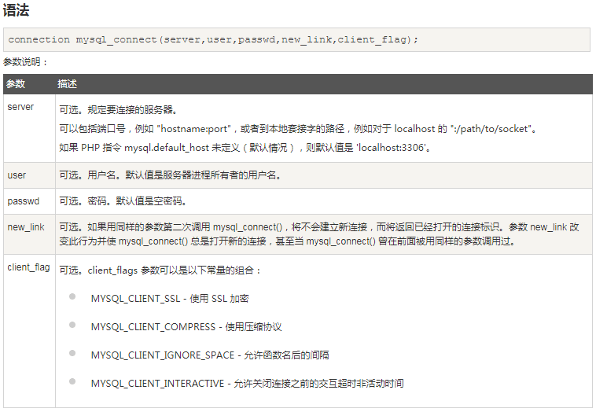
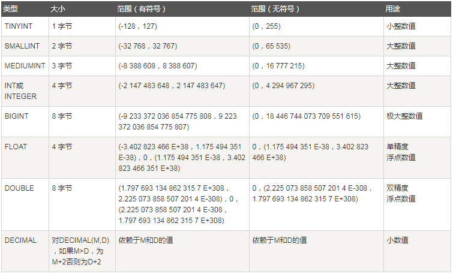
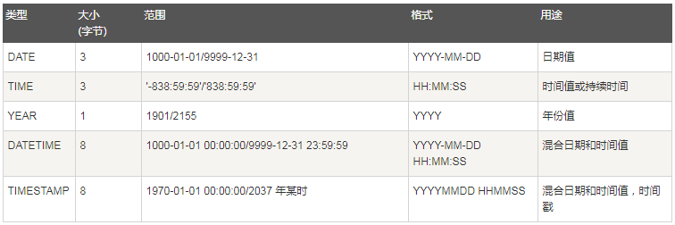
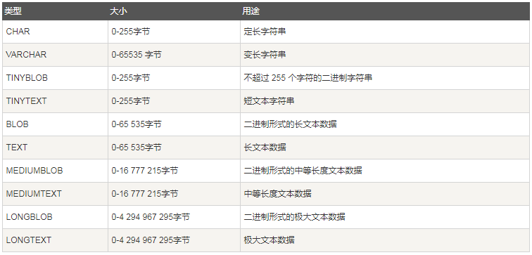
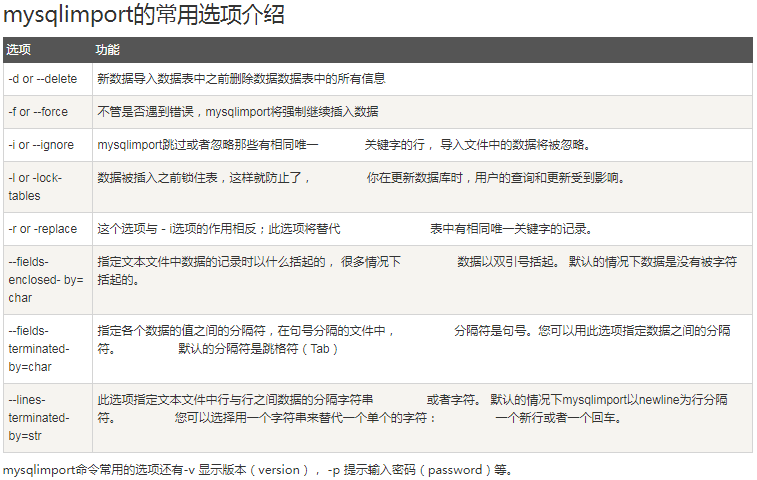

# MySQL

[TOC]

## 什么是数据库？

数据库（Database）是按照数据结构来组织、存储和管理数据的仓库，

每个数据库都有一个或多个不同的API用于创建，访问，管理，搜索和复制所保存的数据。

RDBMS即关系数据库管理系统(Relational Database Management System)的特点：

- 1.数据以表格的形式出现
- 2.每行为各种记录名称
- 3.每列为记录名称所对应的数据域
- 4.许多的行和列组成一张表单
- 5.若干的表单组成database

先了解下RDBMS的一些术语：

- **数据库:** 数据库是一些关联表的集合。.
- **数据表:** 表是数据的矩阵。在一个数据库中的表看起来像一个简单的电子表格。
- **列:** 一列(数据元素) 包含了相同的数据, 例如邮政编码的数据。
- **行：**一行（=元组，或记录）是一组相关的数据，例如一条用户订阅的数据。
- **冗余**：存储两倍数据，冗余可以使系统速度更快。
- **主键**：主键是唯一的。一个数据表中只能包含一个主键。你可以使用主键来查询数据。
- **外键：**外键用于关联两个表。
- **复合键**：复合键（组合键）将多个列作为一个索引键，一般用于复合索引。
- **索引：**使用索引可快速访问数据库表中的特定信息。索引是对数据库表中一列或多列的值进行排序的一种结构。类似于书籍的目录。
- **参照完整性:** 参照的完整性要求关系中不允许引用不存在的实体。与实体完整性是关系模型必须满足的完整性约束条件，目的是保证数据的一致性。

你可以在创建用户时，为用户指定权限，在对应的权限列中，在插入语句中设置为 'Y' 即可，用户权限列表如下：

- Select_priv
- Insert_priv
- Update_priv
- Delete_priv
- Create_priv
- Drop_priv
- Reload_priv
- Shutdown_priv
- Process_priv
- File_priv
- Grant_priv
- References_priv
- Index_priv
- Alter_priv

## MySQL PHP 语法

### MySQL 连接

PHP 提供了 mysql_connect() 函数来连接数据库。

该函数有5个参数，在成功链接到MySQL后返回连接标识，失败返回 FALSE 。



你可以使用PHP的 mysql_close() 函数来断开与MySQL数据库的链接。

该函数只有一个参数为mysql_connect()函数创建连接成功后返回的 MySQL 连接标识符。

本函数关闭指定的连接标识所关联的到 MySQL 服务器的非持久连接。如果没有指定 link_identifier，则关闭上一个打开的连接。通常不需要使用 mysql_close()，因为已打开的非持久连接会在脚本执行完毕后自动关闭.mysql_close() 不会关闭由 mysql_pconnect() 建立的持久连接。

```php+HTML
<html>
<head>
<title>Connecting MySQL Server</title>
</head>
<body>
<?php
   $dbhost = 'localhost:3306';  //mysql服务器主机地址
   $dbuser = 'guest';      //mysql用户名
   $dbpass = 'guest123';//mysql用户名密码
   $conn = mysql_connect($dbhost, $dbuser, $dbpass);
   if(! $conn )
   {
     die('Could not connect: ' . mysql_error());
   }
   echo 'Connected successfully';
   mysql_close($conn);
?>
</body>
</html>
```

### MySQL 创建或者删除数据库

PHP使用 mysql_query 函数来创建或者删除 MySQL 数据库。

该函数有两个参数，在执行成功时返回 TRUE，否则返回 FALSE。

`bool mysql_query( sql, connection );`

| 参数         | 描述                                 |
| ---------- | ---------------------------------- |
| sql        | 必需。规定要发送的 SQL 查询。注释：查询字符串不应以分号结束。  |
| connection | 可选。规定 SQL 连接标识符。如果未规定，则使用上一个打开的连接。 |

```php+HTML
<html>
<head>
<title>创建 MySQL 数据库</title>
</head>
<body>
<?php
$dbhost = 'localhost:3036';
$dbuser = 'root';
$dbpass = 'rootpassword';
$conn = mysql_connect($dbhost, $dbuser, $dbpass);
if(! $conn )
{
  die('连接错误: ' . mysql_error());
}
echo '连接成功<br />';
$sql = 'CREATE DATABASE php';//创建
//$sql = 'DROP DATABASE php';//删除
$retval = mysql_query( $sql, $conn );
if(! $retval )
{
  die('创建数据库失败: ' . mysql_error());
}
echo "数据库 php 创建成功\n";
mysql_close($conn);
?>
</body>
</html>
```

### MySQL 选择数据库

PHP 提供了函数 mysql_select_db  来选取一个数据库。函数在执行成功后返回 TRUE ，否则返回 FALSE 。

`bool mysql_select_db( db_name, connection );`

| 参数         | 描述                             |
| ---------- | ------------------------------ |
| db_name    | 必需。规定要选择的数据库。                  |
| connection | 可选。规定 MySQL 连接。如果未指定，则使用上一个连接。 |

### MySQL 数据类型

#### 数值类型



#### 日期和时间类型



#### 字符串类型



### MySQL 创建或删除数据表

创建MySQL数据表需要以下信息：

- 表名
- 表字段名
- 定义每个表字段

以下为创建MySQL数据表的SQL通用语法：

`CREATE TABLE table_name (column_name column_type);`

以下例子中我们将在 php 数据库中创建数据表php_tbl：

```php+HTML
php_tbl(
   php_id INT NOT NULL AUTO_INCREMENT,
   php_title VARCHAR(100) NOT NULL,
   php_author VARCHAR(40) NOT NULL,
   submission_date DATE,
   PRIMARY KEY ( php_id )
);
```

实例解析：

- 如果你不想字段为 **NULL** 可以设置字段的属性为 **NOT NULL**， 在操作数据库时如果输入该字段的数据为**NULL** ，就会报错。
- AUTO_INCREMENT定义列为自增的属性，一般用于主键，数值会自动加1。
- PRIMARY KEY关键字用于定义列为主键。 您可以使用多列来定义主键，列间以逗号分隔。

可以使用PHP的 mysql_query() 函数来创建已存在数据库的数据表。删除MySQL数据表的通用语法：

`DROP TABLE table_name ;`

```php+HTML
$sql = "CREATE TABLE php_tbl( ".
       "php_id INT NOT NULL AUTO_INCREMENT, ".
       "php_title VARCHAR(100) NOT NULL, ".
       "php_author VARCHAR(40) NOT NULL, ".
       "submission_date DATE, ".
       "PRIMARY KEY ( php_id )); ";
mysql_select_db( 'php' );
$retval = mysql_query( $sql, $conn );

$sql = "DROP TABLE php_tbl";//删除
```

### MySQL 插入数据

可以使用PHP 的 mysql_query() 函数来执行 **SQL INSERT INTO**命令来插入数据。该函数有两个参数，在执行成功时返回 TRUE，否则返回 FALSE。

```php+HTML
<html>
<head>
<title>向 MySQL 数据库添加数据</title>
</head>
<body>
<?php
if(isset($_POST['add']))
{
$dbhost = 'localhost:3036';
$dbuser = 'root';
$dbpass = 'rootpassword';
$conn = mysql_connect($dbhost, $dbuser, $dbpass);
if(! $conn )
{
  die('Could not connect: ' . mysql_error());
}

if(! get_magic_quotes_gpc() )
{
   $php_title = addslashes ($_POST['php_title']);
   $php_author = addslashes ($_POST['php_author']);
}
else
{
   $php_title = $_POST['php_title'];
   $php_author = $_POST['php_author'];
}
$submission_date = $_POST['submission_date'];

$sql = "INSERT INTO php_tbl ".
       "(php_title,php_author, submission_date) ".
       "VALUES ".
       "('$php_title','$php_author','$submission_date')";
mysql_select_db('php');
$retval = mysql_query( $sql, $conn );
if(! $retval )
{
  die('Could not enter data: ' . mysql_error());
}
echo "Entered data successfully\n";
mysql_close($conn);
}
else
{
?>
<form method="post" action="<?php $_PHP_SELF ?>">
<table width="600" border="0" cellspacing="1" cellpadding="2">
<tr>
<td width="250">Tutorial Title</td>
<td>
<input name="php_title" type="text" id="php_title">
</td>
</tr>
<tr>
<td width="250">Tutorial Author</td>
<td>
<input name="php_author" type="text" id="php_author">
</td>
</tr>
<tr>
<td width="250">Submission Date [ yyyy-mm-dd ]</td>
<td>
<input name="submission_date" type="text" id="submission_date">
</td>
</tr>
<tr>
<td width="250"> </td>
<td> </td>
</tr>
<tr>
<td width="250"> </td>
<td>
<input name="add" type="submit" id="add" value="Add Tutorial">
</td>
</tr>
</table>
</form>
<?php
}
?>
</body>
</html>
```

在我们接收用户提交的数据时，为了数据的安全性我们需要使用 get_magic_quotes_gpc() 函数来判断特殊字符的转义是否已经开启。如果这个选项为off（未开启），返回0，那么我们就必须调用addslashes 这个函数来为字符串增加转义。

### MySQL 查询数据

以下为在MySQL数据库中查询数据通用的 SELECT 语法：

```
SELECT column_name,column_name
FROM table_name
[WHERE Clause]
[OFFSET M ][LIMIT N]
```

- 查询语句中你可以使用一个或者多个表，表之间使用逗号(,)分割，并使用WHERE语句来设定查询条件。
- SELECT 命令可以读取一条或者多条记录。
- 你可以使用星号（*）来代替其他字段，SELECT语句会返回表的所有字段数据
- 你可以使用 WHERE 语句来包含任何条件。
- 你可以通过OFFSET指定SELECT语句开始查询的数据偏移量。默认情况下偏移量为0。
- 你可以使用 LIMIT 属性来设定返回的记录数。

使用PHP函数的mysql_query()及SQL SELECT命令来获取数据。该函数用于执行SQL命令，然后通过 PHP 函数 mysql_fetch_array() 来使用或输出所有查询的数据。mysql_fetch_array() 函数从结果集中取得一行作为关联数组，或数字数组，或二者兼有 返回根据从结果集取得的行生成的数组，如果没有更多行则返回 false。在我们执行完SELECT语句后，释放游标内存是一个很好的习惯。可以通过PHP函数mysql_free_result()来实现内存的释放。

### MySQL where 子句

我们知道从MySQL表中使用SQL SELECT 语句来读取数据。

如需有条件地从表中选取数据，可将 WHERE 子句添加到 SELECT 语句中。

```
SELECT field1, field2,...fieldN FROM table_name1, table_name2...
[WHERE condition1 [AND [OR]] condition2.....
```

- 查询语句中你可以使用一个或者多个表，表之间使用逗号(,)分割，并使用WHERE语句来设定查询条件。
- 你可以在WHERE子句中指定任何条件。
- 你可以使用AND或者OR指定一个或多个条件。
- WHERE子句也可以运用于SQL的 DELETE 或者 UPDATE 命令。
- WHERE 子句类似于程序语言中的if条件，根据 MySQL 表中的字段值来读取指定的数据。

### MySQL UPDATE 查询

如果我们需要修改或更新MySQL中的数据，我们可以使用 SQL UPDATE 命令来操作。

以下是 UPDATE 命令修改 MySQL 数据表数据的通用SQL语法：

```
UPDATE table_name SET field1=new-value1, field2=new-value2
[WHERE Clause]
```

- 你可以同时更新一个或多个字段。
- 你可以在 WHERE 子句中指定任何条件。
- 你可以在一个单独表中同时更新数据。

### MySQL DELETE 语句

可以使用 SQL 的 DELETE FROM 命令来删除 MySQL 数据表中的记录。以下是SQL DELETE 语句从MySQL数据表中删除数据的通用语法：

`DELETE FROM table_name [WHERE Clause]`

- 如果没有指定 WHERE 子句，MySQL表中的所有记录将被删除。
- 你可以在 WHERE 子句中指定任何条件
- 您可以在单个表中一次性删除记录。

### MySQL LIKE 子句

有时候我们需要获取 php_author 字段含有 "jay" 字符的所有记录，这时我们就需要在 WHERE 子句中使用 SQL LIKE 子句。SQL LIKE 子句中使用百分号(%)字符来表示任意字符，类似于UNIX或正则表达式中的星号 (*)。如果没有使用百分号(%), LIKE 子句与等号（=）的效果是一样的。

以下是SQL SELECT 语句使用 LIKE 子句从数据表中读取数据的通用语法：

- 你可以在WHERE子句中指定任何条件。
- 你可以在WHERE子句中使用LIKE子句。
- 你可以使用LIKE子句代替等号(=)。
- LIKE 通常与 % 一同使用，类似于一个元字符的搜索。
- 你可以使用AND或者OR指定一个或多个条件。
- 你可以在 DELETE 或 UPDATE 命令中使用  WHERE...LIKE 子句来指定条件。

```
SELECT field1, field2,...fieldN table_name1, table_name2...
WHERE field1 LIKE condition1 [AND [OR]] filed2 = 'somevalue'
```

### MySQL 排序

如果我们需要对读取的数据进行排序，我们就可以使用 MySQL 的 **ORDER BY** 子句来设定你想按哪个字段哪中方式来进行排序，再返回搜索结果。

以下是 SQL SELECT 语句使用 ORDER BY 子句将查询数据排序后再返回数据：

```
SELECT field1, field2,...fieldN table_name1, table_name2...
ORDER BY field1, [field2...] [ASC [DESC]]

$sql = 'SELECT php_id, php_title, 
               php_author, submission_date
        FROM php_tbl
        ORDER BY  php_author DESC';

mysql_select_db('php');
$retval = mysql_query( $sql, $conn );
```

- 你可以使用任何字段来作为排序的条件，从而返回排序后的查询结果。
- 你可以设定多个字段来排序。
- 你可以使用 ASC 或 DESC 关键字来设置查询结果是按升序或降序排列。 默认情况下，它是按升序排列。
- 你可以添加 WHERE...LIKE 子句来设置条件。

### MySQL 分组

GROUP BY 语句根据一个或多个列对结果集进行分组。在分组的列上我们可以使用 COUNT, SUM, AVG,等函数。WITH ROLLUP 可以实现在分组统计数据基础上再进行相同的统计（SUM,AVG,COUNT…）。例如我们将以上的数据表按名字进行分组，再统计每个人登录的次数。

```
SELECT column_name, function(column_name)
FROM table_name
WHERE column_name operator value
GROUP BY column_name;
```

### Mysql 连接的使用

如何使用 MySQL 的 JOIN 在两个或多个表中查询数据。可以在SELECT, UPDATE 和 DELETE 语句中使用 Mysql 的 JOIN 来联合多表查询。JOIN 按照功能大致分为如下三类：

- **INNER JOIN（内连接,或等值连接）**：获取两个表中字段匹配关系的记录。
- **LEFT JOIN（左连接）：**获取左表所有记录，即使右表没有对应匹配的记录。
- **RIGHT JOIN（右连接）：** 与 LEFT JOIN 相反，用于获取右表所有记录，即使左表没有对应匹配的记录。


### MySQL NULL 值处理

MySQL提供了三大运算符:

- **IS NULL:** 当列的值是NULL,此运算符返回true。
- **IS NOT NULL:** 当列的值不为NULL, 运算符返回true。
- **<=>:** 比较操作符（不同于=运算符），当比较的的两个值为NULL时返回true。

关于 NULL 的条件比较运算是比较特殊的。你不能使用 = NULL 或 != NULL 在列中查找 NULL 值 。

在MySQL中，NULL值与任何其它值的比较（即使是NULL）永远返回false，即 NULL = NULL 返回false 。

MySQL中处理NULL使用IS NULL和IS NOT NULL运算符。

### MySQL 正则表达式

下表中的正则模式可应用于 REGEXP 操作符中。

| 模式         | 描述                                       |
| ---------- | ---------------------------------------- |
| ^          | 匹配输入字符串的开始位置。如果设置了 RegExp 对象的 Multiline 属性，^ 也匹配 '\n' 或 '\r' 之后的位置。 |
| $          | 匹配输入字符串的结束位置。如果设置了RegExp 对象的 Multiline 属性，$ 也匹配 '\n' 或 '\r' 之前的位置。 |
| .          | 匹配除 "\n" 之外的任何单个字符。要匹配包括 '\n' 在内的任何字符，请使用象 '[.\n]' 的模式。 |
| [...]      | 字符集合。匹配所包含的任意一个字符。例如， '[abc]' 可以匹配 "plain" 中的 'a'。 |
| [^...]     | 负值字符集合。匹配未包含的任意字符。例如， '[^abc]' 可以匹配 "plain" 中的'p'。 |
| p1\|p2\|p3 | 匹配 p1 或 p2 或 p3。例如，'z\|food' 能匹配 "z" 或 "food"。'(z\|f)ood' 则匹配 "zood" 或 "food"。 |
| *          | 匹配前面的子表达式零次或多次。例如，zo* 能匹配 "z" 以及 "zoo"。* 等价于{0,}。 |
| +          | 匹配前面的子表达式一次或多次。例如，'zo+' 能匹配 "zo" 以及 "zoo"，但不能匹配 "z"。+ 等价于 {1,}。 |
| {n}        | n 是一个非负整数。匹配确定的 n 次。例如，'o{2}' 不能匹配 "Bob" 中的 'o'，但是能匹配 "food" 中的两个 o。 |
| {n,m}      | m 和 n 均为非负整数，其中n <= m。最少匹配 n 次且最多匹配 m 次。 |

### MySQL 事务

MySQL 事务主要用于处理操作量大，复杂度高的数据。比如说，在人员管理系统中，你删除一个人员，你即需要删除人员的基本资料，也要删除和该人员相关的信息，如信箱，文章等等，这样，这些数据库操作语句就构成一个事务！

- 在MySQL中只有使用了Innodb数据库引擎的数据库或表才支持事务
- 事务处理可以用来维护数据库的完整性，保证成批的SQL语句要么全部执行，要么全部不执行
- 事务用来管理insert,update,delete语句

一般来说，事务是必须满足4个条件（ACID）： Atomicity（原子性）、Consistency（稳定性）、Isolation（隔离性）、Durability（可靠性）

- 1、**事务的原子性：**一组事务，要么成功；要么撤回。
- 2、**稳定性** ： 有非法数据（外键约束之类），事务撤回。
- 3、**隔离性：**事务独立运行。一个事务处理后的结果，影响了其他事务，那么其他事务会撤回。事务的100%隔离，需要牺牲速度。
- 4、**可靠性：**软、硬件崩溃后，InnoDB数据表驱动会利用日志文件重构修改。可靠性和高速度不可兼得， innodb_flush_log_at_trx_commit选项 决定什么时候吧事务保存到日志里。

```php+HTML
<?php
$handler=mysql_connect("localhost","root","password");
mysql_select_db("task");
mysql_query("SET AUTOCOMMIT=0");//设置为不自动提交，因为MYSQL默认立即执行
mysql_query("BEGIN");//开始事务定义
if(!mysql_query("insert into trans (id) values('2')"))
{
mysql_query("ROLLBACK");//判断当执行失败时回滚
}
if(!mysql_query("insert into trans (id) values('4')"))
{
mysql_query("ROLLBACK");//判断执行失败回滚
}
mysql_query("COMMIT");//执行事务
mysql_close($handler);
?>
```

### MySQL ALTER命令

当我们需要修改数据表名或者修改数据表字段时，就需要使用到MySQL ALTER命令。

### MySQL 索引

唯一索引与普通索引类似，不同的就是：索引列的值必须唯一，但允许有空值。如果是组合索引，则列值的组合必须唯一。

```
CREATE INDEX indexName ON mytable(username(length)); //创建索引
ALTER mytable ADD INDEX [indexName] ON (username(length)) //修改表结构
DROP INDEX [indexName] ON mytable; //删除索引
CREATE UNIQUE INDEX indexName ON mytable(username(length)) //创建唯一索引
```

使用ALTER 命令添加和删除索引，有四种方式来添加数据表的索引：

- **ALTER TABLE tbl_name ADD PRIMARY KEY (column_list):** 该语句添加一个主键，这意味着索引值必须是唯一的，且不能为NULL。
- **ALTER TABLE tbl_name ADD UNIQUE index_name (column_list):** 这条语句创建索引的值必须是唯一的（除了NULL外，NULL可能会出现多次）。
- **ALTER TABLE tbl_name ADD INDEX index_name (column_list):** 添加普通索引，索引值可出现多次。
- **ALTER TABLE tbl_name ADD FULLTEXT index_name (column_list):**该语句指定了索引为  FULLTEXT ，用于全文索引。

### MySQL 临时表

MySQL 临时表在我们需要保存一些临时数据时是非常有用的。临时表只在当前连接可见，当关闭连接时，Mysql会自动删除表并释放所有空间。MySQL临时表只在当前连接可见，如果你使用PHP脚本来创建MySQL临时表，那没当PHP脚本执行完成后，该临时表也会自动销毁。如果你使用了其他MySQL客户端程序连接MySQL数据库服务器来创建临时表，那么只有在关闭客户端程序时才会销毁临时表，当然你也可以手动销毁。

### MySQL 复制表

如果我们需要完全的复制MySQL的数据表，包括表的结构，索引，默认值等。 如果仅仅使用**CREATE TABLE ... SELECT **命令，是无法实现的。

本章节将为大家介绍如何完整的复制MySQL数据表，步骤如下：

- 使用 **SHOW CREATE TABLE** 命令获取创建数据表(**CREATE TABLE**) 语句，该语句包含了原数据表的结构，索引等。
- 复制以下命令显示的SQL语句，修改数据表名，并执行SQL语句，通过以上命令 将完全的复制数据表结构。
- 如果你想复制表的内容，你就可以使用**INSERT INTO ... SELECT **语句来实现。

### MySQL 元数据

你可能想知道MySQL以下三种信息：

- **查询结果信息：**SELECT, UPDATE 或 DELETE语句影响的记录数。
- **数据库和数据表的信息：**包含了数据库及数据表的结构信息。
- **MySQL服务器信息：**包含了数据库服务器的当前状态，版本号等。

在PHP中，你可以使用 mysql_affected_rows( ) 函数来获取查询语句影响的记录数。你可以很容易的在MySQL服务器中获取数据库和数据表列表。 如果你没有足够的权限，结果将返回 null。你也可以使用 SHOW TABLES 或 SHOW DATABASES 语句来获取数据库和数据表列表。

以下命令语句可以在MySQL的命令提示符使用，也可以在脚本中 使用，如PHP脚本。

| 命令                 | 描述             |
| ------------------ | -------------- |
| SELECT VERSION( )  | 服务器版本信息        |
| SELECT DATABASE( ) | 当前数据库名 (或者返回空) |
| SELECT USER( )     | 当前用户名          |
| SHOW STATUS        | 服务器状态          |
| SHOW VARIABLES     | 服务器配置变量        |

### MySQL 处理重复数据

有些 MySQL 数据表中可能存在重复的记录，有些情况我们允许重复数据的存在，但有时候我们也需要删除这些重复的数据。你可以在MySQL数据表中设置指定的字段为**PRIMARY KEY（主键） **或者**UNIQUE（唯一）**索引来保证数据的唯一性。一般情况下，查询重复的值，请执行以下操作：

- 确定哪一列包含的值可能会重复。
- 在列选择列表使用COUNT(*)列出的那些列。
- 在GROUP BY子句中列出的列。
- HAVING子句设置重复数大于1。

如果你需要读取不重复的数据可以在 SELECT 语句中使用 DISTINCT 关键字来过滤重复数据。

### MySQL 及 SQL 注入

如果您通过网页获取用户输入的数据并将其插入一个MySQL数据库，那么就有可能发生SQL注入安全的问题。所谓SQL注入，就是通过把SQL命令插入到Web表单递交或输入域名或页面请求的查询字符串，最终达到欺骗服务器执行恶意的SQL命令。我们永远不要信任用户的输入，我们必须认定用户输入的数据都是不安全的，我们都需要对用户输入的数据进行过滤处理。

在PHP中的 mysql_query() 是不允许执行多个SQL语句的，但是在 SQLite 和 PostgreSQL 是可以同时执行多条SQL语句的，所以我们对这些用户的数据需要进行严格的验证。防止SQL注入，我们需要注意以下几个要点：

- 1.永远不要信任用户的输入。对用户的输入进行校验，可以通过正则表达式，或限制长度；对单引号和 双"-"进行转换等。
- 2.永远不要使用动态拼装sql，可以使用参数化的sql或者直接使用存储过程进行数据查询存取。
- 3.永远不要使用管理员权限的数据库连接，为每个应用使用单独的权限有限的数据库连接。
- 4.不要把机密信息直接存放，加密或者hash掉密码和敏感的信息。
- 5.应用的异常信息应该给出尽可能少的提示，最好使用自定义的错误信息对原始错误信息进行包装
- 6.sql注入的检测方法一般采取辅助软件或网站平台来检测，软件一般采用sql注入检测工具jsky，网站平台就有亿思网站安全平台检测工具。MDCSOFT SCAN等。采用MDCSOFT-IPS可以有效的防御SQL注入，XSS攻击等。

在脚本语言，如Perl和PHP你可以对用户输入的数据进行转义从而来防止SQL注入。PHP的MySQL扩展提供了mysql_real_escape_string()函数来转义特殊的输入字符。like查询时，如果用户输入的值有"_"和"%"，则会出现这种情况：用户本来只是想查询"abcd_"，查询结果中却有"abcd_"、"abcde"、"abcdf"等等；用户要查询"30%"（注：百分之三十）时也会出现问题。在PHP脚本中我们可以使用addcslashes()函数来处理以上情况。

### MySQL 导入和导出数据

MySQL中你可以使用**SELECT...INTO OUTFILE**语句来简单的导出数据到文本文件上。

SELECT ... INTO OUTFILE 语句有以下属性:

- LOAD DATA INFILE是SELECT ... INTO OUTFILE的逆操作，SELECT句法。为了将一个数据库的数据写入一个文件，使用SELECT ... INTO OUTFILE，为了将文件读回数据库，使用LOAD DATA INFILE。
- SELECT...INTO OUTFILE 'file_name'形式的SELECT可以把被选择的行写入一个文件中。该文件被创建到服务器主机上，因此您必须拥有FILE权限，才能使用此语法。
- 输出不能是一个已存在的文件。防止文件数据被篡改。
- 你需要有一个登陆服务器的账号来检索文件。否则 SELECT ... INTO OUTFILE 不会起任何作用。
- 在UNIX中，该文件被创建后是可读的，权限由MySQL服务器所拥有。这意味着，虽然你就可以读取该文件，但可能无法将其删除。

MySQL 中提供了LOAD DATA INFILE语句来插入数据。 以下实例中将从当前目录中读取文件 dump.txt ，将该文件中的数据插入到当前数据库的 mytbl 表中。

`mysql> LOAD DATA LOCAL INFILE 'dump.txt' INTO TABLE mytbl;`

mysqlimport客户端提供了LOAD DATA INFILEQL语句的一个命令行接口。mysqlimport的大多数选项直接对应LOAD DATA INFILE子句。



