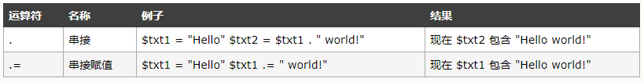
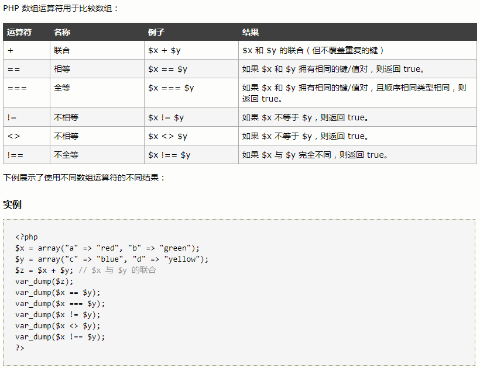
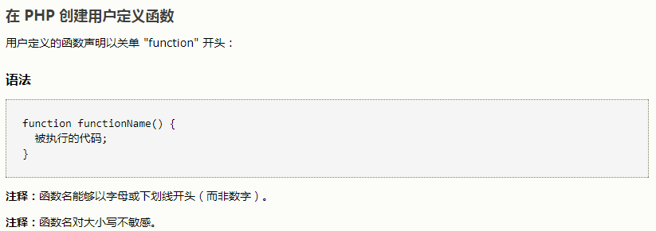
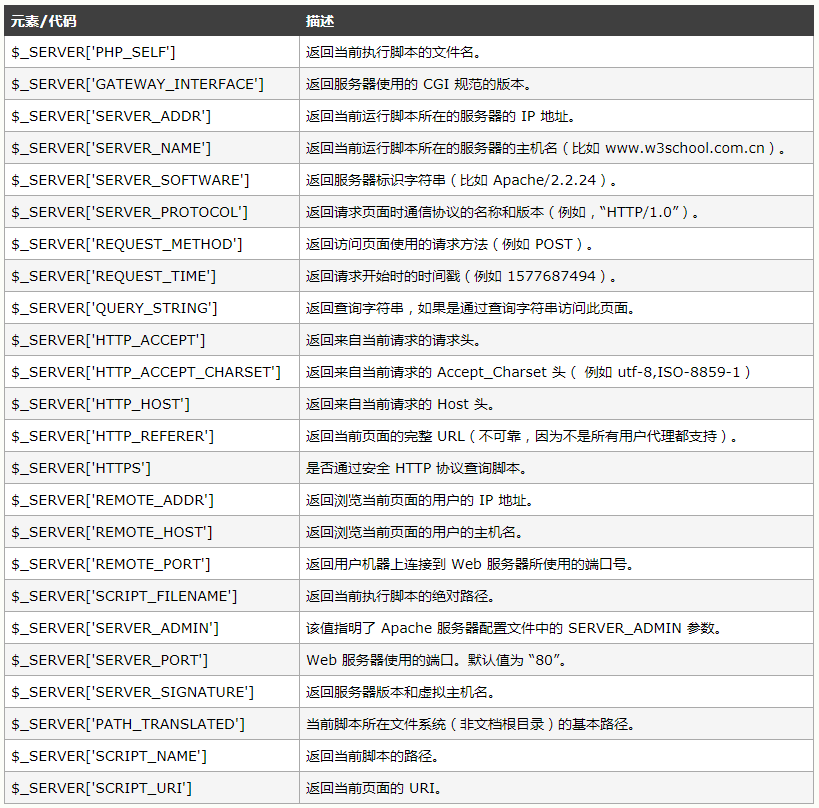
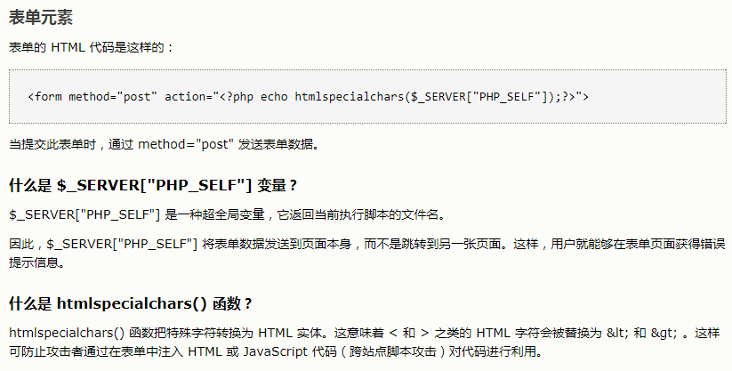

# PHP

[TOC]


## 什么是 PHP？

- PHP 是 "PHP Hypertext Preprocessor" 的首字母缩略词
- PHP 是一种被广泛使用的开源脚本语言
- PHP 脚本在服务器上执行
- PHP 没有成本，可供免费下载和使用

## PHP 是一门令人惊叹的流行语言！

- 它强大到足以成为在网络上最大的博客系统的核心（WordPress）！
- 它深邃到足以运行最大的社交网络（facebook）！
- 而它的易用程度足以成为初学者的首选服务器端语言！

## PHP 能够做什么？

- PHP 能够生成动态页面内容
- PHP 能够创建、打开、读取、写入、删除以及关闭服务器上的文件
- PHP 能够接收表单数据
- PHP 能够发送并取回 cookies
- PHP 能够添加、删除、修改数据库中的数据
- PHP 能够限制用户访问网站中的某些页面
- PHP 能够对数据进行加密

通过 PHP，您可以不受限于只输出 HTML。您还能够输出图像、PDF 文件、甚至 Flash 影片。您也可以输出任何文本，比如 XHTML 和 XML。

## 基础 PHP 语法

PHP 脚本可放置于文档中的任何位置。

PHP 脚本以 *<?php* 开头，以 *?>* 结尾：

```
<?php
// 此处是 PHP 代码
?>
```

## PHP 支持三种注释：

```php+HTML
<!DOCTYPE html>
<html>
<body>

<?php
// 这是单行注释

# 这也是单行注释

/*
这是多行注释块
它横跨了
多行
*/
?>

</body>
</html>
```

## PHP 大小写敏感

在 PHP 中，所有用户定义的函数、类和关键词（例如 if、else、echo 等等）都对大小写不敏感。不过在 PHP 中，所有变量都对大小写敏感。

## PHP 变量

### PHP 变量规则：

- 变量以 $ 符号开头，其后是变量的名称
- 变量名称必须以字母或下划线开头
- 变量名称不能以数字开头
- 变量名称只能包含字母数字字符和下划线（A-z、0-9 以及 _）
- 变量名称对大小写敏感（$y 与 $Y 是两个不同的变量）

PHP 没有创建变量的命令，变量会在首次为其赋值时被创建。

### PHP 变量作用域

在 PHP 中，可以在脚本的任意位置对变量进行声明。

变量的作用域指的是变量能够被引用/使用的那部分脚本。

PHP 有三种不同的变量作用域：

- local（局部）
- global（全局）
- static（静态）

### Local 和 Global 作用域

函数之外声明的变量拥有 Global 作用域，只能在函数以外进行访问。

函数内部声明的变量拥有 LOCAL 作用域，只能在函数内部进行访问。

### PHP global 关键词

global 关键词用于访问函数内的全局变量。

要做到这一点，请在（函数内部）变量前面使用 global 关键词：

```php+HTML
<?php
$x=5;
$y=10;

function myTest() {
  global $x,$y;
  $y=$x+$y;
}

myTest();
echo $y; // 输出 15
?>
```

PHP 同时在名为 $GLOBALS[index] 的数组中存储了所有的全局变量。下标存有变量名。这个数组在函数内也可以访问，并能够用于直接更新全局变量。

上面的例子可以这样重写：

```php+HTML
<?php
$x=5;
$y=10;

function myTest() {
  $GLOBALS['y']=$GLOBALS['x']+$GLOBALS['y'];
} 

myTest();
echo $y; // 输出 15
?>
```

### PHP static 关键词

通常，当函数完成/执行后，会删除所有变量。不过，有时我需要不删除某个局部变量。实现这一点需要更进一步的工作。要完成这一点，请在您首次声明变量时使用 **static** 关键词。

## echo 和 print 语句

### PHP echo 和 print 语句

echo 和 print 之间的差异：

- echo - 能够输出一个以上的字符串
- print - 只能输出一个字符串，并始终返回 1

提示：echo 比 print 稍快，因为它不返回任何值。

### PHP echo 语句

echo 是一个语言结构，有无括号均可使用：echo 或 echo()。

### PHP print 语句

print 也是语言结构，有无括号均可使用：print 或 print()。

## PHP 数据类型

### 字符串、整数、浮点数、逻辑、数组、对象、NULL

var_dump() 会返回变量的数据类型和值。

```php+HTML
<?php 

$cars=array("Volvo","BMW","SAAB");
var_dump($cars);
//对象
class Car
{
  var $color;
  function Car($color="green") {
    $this->color = $color;
  }
  function what_color() {
    return $this->color;
  }
}
?>
```

## PHP 常量

常量是单个值的标识符（名称）。在脚本中无法改变该值。

有效的常量名以字符或下划线开头（常量名称前面没有 $ 符号）。

**注释：**与变量不同，常量贯穿整个脚本是自动全局的。

### 设置 PHP 常量

如需设置常量，请使用 define() 函数 - 它使用三个参数：

1. 首个参数定义常量的名称
2. 第二个参数定义常量的值
3. 可选的第三个参数规定常量名是否对大小写不敏感。默认是 false。

```php+HTML
<?php
define("GREETING", "Welcome to W3School.com.cn!");//对大小写敏感的常量
echo GREETING;
?>
```

## PHP 字符串运算符



## PHP 数组运算符



## PHP 其他操作符

- 错误抑制操作符@

  可以在任何表达式前面使用，例如 \$a=@(57/0)，这个警告会被抑制住。如果在 php.ini 文件中启用了 PHP 的track_errors特性，错误信息将会被保存在全局变量 \$php_errormsg 中。

- 执行操作符``

  它是一对反向单引号，PHP 会试着将反向单引号之间的命令当作服务器端命令行命令来执行。`$out='ls -la';echo $out;`

## 变量处理函数

- gettype()：返回变量的类型，如果不是标准类型之一，返回 unknown type
- settype()：设置变量的类型
- is_array()
- is_resource()：是否是一个资源。
- is_callabel()：是否是有效的函数名称
- isset()：变量存在返回true
- empty()：检查变量是否存在，以及它的值是否为非空和非0。
- intval()
- floatval()
- strval()

## 使用declare

```php
declare(directive){
    //block
}
```

这种结构用来设置代码块的执行指令，目前 PHP 提供了两个执行指令，ticks 和 encoding。插入指令 ticks=n 它允许在代码块内部没执行 n 行代码后运行特定函数。

## PHP foreach 循环

foreach 循环只适用于数组，并用于遍历数组中的每个键/值对。

```php+HTML
<?php 
$colors = array("red","green","blue","yellow"); 

foreach ($colors as $value) {
  echo "$value <br>";
}

$colors = array("red"=>10,"green"=>20,"blue"=>30,"yellow"=>40); 

foreach ($colors as $key => $value) {
  echo "$key.' '.$value <br>";
}
?>
```

## each

```php+HTML
<?php 
$colors = array("red"=>10,"green"=>20,"blue"=>30,"yellow"=>40); 

while ($color=each($colors)) {
  echo "$element['key'].' '.$element['value'] <br>";
}

while(list($name,$num)=each($colors)){
  echo "$name.' '.$num <br>"; 
}
?>
```

## array_walk()

对数组每个元素应用函数

## shuffle

把数组中的元素按随机顺序重新排序

## PHP 函数

PHP 的真正力量来自它的函数：它拥有超过 1000 个内建的函数。

### 在 PHP 创建用户定义函数



## PHP 数组

### 在 PHP 中创建数组

在 PHP 中， array() 函数用于创建数组：

```
array();
```

在 PHP 中，有三种数组类型：

- **索引数组** - 带有数字索引的数组
- **关联数组** - 带有指定键的数组
- **多维数组** - 包含一个或多个数组的数组

```php
$cars=array("Volvo","BMW","SAAB");//索引数组
$age=array("Peter"=>"35","Ben"=>"37","Joe"=>"43");//关联数组
foreach($age as $x=>$x_value) {
  echo "Key=" . $x . ", Value=" . $x_value;
  echo "<br>";
}
```

### PHP 两维数组

```php
$cars = array
  (
  array("Volvo",22,18),
  array("BMW",15,13),
  array("Saab",5,2),
  array("Land Rover",17,15)
  );
```

### PHP 数组排序

- sort() - 以升序对数组排序
- rsort() - 以降序对数组排序
- asort() - 根据值，以升序对关联数组进行排序
- ksort() - 根据键，以升序对关联数组进行排序
- arsort() - 根据值，以降序对关联数组进行排序
- krsort() - 根据键，以降序对关联数组进行排序

## PHP 全局变量 - 超全局变量

这些超全局变量是：

- $GLOBALS
- $_SERVER
- $_REQUEST
- $_POST
- $_GET
- $_FILES
- $_ENV
- $_COOKIE
- $_SESSION



## 字符串操作和正则表达式

使用 Perl 风格的正则表达式语法，每个表达式必须包含在一对分隔符中。可以选择任何非字母、数字、“、”或空格的字符作为分隔符。有时，可能需要在结束分隔符后添加一个模式修饰符。

|     .     |                       匹配任意一个字符                       |
| :-------: | :----------------------------------------------------------: |
|    []     |           字符集匹配，匹配方括号中定义的字符集之一           |
|    [^]    |                 匹配没有在方括号中定义的字符                 |
|     ^     |                         匹配开始位置                         |
|     $     |                         匹配结束位置                         |
|  \\(\\)   |                         定义子表达式                         |
|    \n     |            子表达式向前引用，n 为 1-9 之间的数字             |
|     *     |                 任意次匹配（零次或多次匹配）                 |
| \\{m,n\\} | 至少 m 次，至多 n 次匹配；\\{m\\} 表示 m 次精确匹配；\\{m,\\} 表示至少 m 次匹配 |
|     ?     |                最多一次匹配（零次或一次匹配）                |
|     +     |               至少一次匹配（一次或更多次匹配）               |
|    \|     |           或运算，其左右操作数均可以为一个子表达式           |

## 匿名（闭包）函数实现

使用 use 关键字显示定义这些变量，可以对全局作用域变量的访问。

```php
$printer=function($value){echo "$value <br/>";};

$markup=0.2;
$apply=function(&$val) use ($markup){
    $val=$val*(1+$markup);
}
```

## 使用 Trait

Trait 是能够充分利用多重继承又不带来痛苦的方法。可以对将在多个类中复用的功能进行分组。

```php
trait logger{
    public function logmessage($message,$level='DEBUG'){
        
    }
}
class fileStorage{
    use logger;
    function store($data){
        $this->logmessage($msg);
    }
}
```


# PHP表单

```php+HTML
<!DOCTYPE HTML>
<html> 
<body>

<form action="/demo/welcome.php" method="post">
姓名：<input type="text" name="name"><br>
电邮：<input type="text" name="email"><br>
<input type="submit">
</form>

</body>
</html>
```

```php+HTML
<html>
<body>

Welcome <?php echo $_POST["name"]; ?><br>
Your email address is: <?php echo $_POST["email"]; ?>

</body>
</html>
```

## GET vs. POST

GET 和 POST 都创建数组（例如，array( key => value, key2 => value2, key3 => value3, ...)）。此数组包含键/值对，其中的键是表单控件的名称，而值是来自用户的输入数据。

GET 和 POST 被视作\$\_GET 和 \$_POST。它们是超全局变量，这意味着对它们的访问无需考虑作用域 - 无需任何特殊代码，您能够从任何函数、类或文件访问它们。

$_GET 是通过 URL 参数传递到当前脚本的变量数组。

$_POST 是通过 HTTP POST 传递到当前脚本的变量数组。

## 何时使用 GET？

通过 GET 方法从表单发送的信息**对任何人都是可见的 **（所有变量名和值都显示在 URL 中）。GET 对所发送信息的数量也有限制。限制在大于 2000 个字符。不过，由于变量显示在 URL 中，把页面添加到书签中也更为方便。

GET 可用于发送非敏感的数据。

注释：绝不能使用 GET 来发送密码或其他敏感信息！

## 何时使用 POST？

通过 POST 方法从表单发送的信息**对其他人是不可见的 **（所有名称/值会被嵌入 HTTP 请求的主体中），并且对所发送信息的数量也**无限制 **。

此外 POST 支持高阶功能，比如在向服务器上传文件时进行 multi-part 二进制输入。

不过，由于变量未显示在 URL 中，也就无法将页面添加到书签。

## PHP 表单验证



## PHP 表单必填

```php+HTML

<!DOCTYPE HTML> 
<html>
<head>
<style>
.error {color: #FF0000;}
</style>
</head>
<body> 

<?php
// 定义变量并设置为空值
$nameErr = $emailErr = $genderErr = $websiteErr = "";
$name = $email = $gender = $comment = $website = "";

if ($_SERVER["REQUEST_METHOD"] == "POST") {
   if (empty($_POST["name"])) {
     $nameErr = "姓名是必填的";
   } else {
     $name = test_input($_POST["name"]);
     // 检查姓名是否包含字母和空白字符
     if (!preg_match("/^[a-zA-Z ]*$/",$name)) {
       $nameErr = "只允许字母和空格"; 
     }
   }
   
   if (empty($_POST["email"])) {
     $emailErr = "电邮是必填的";
   } else {
     $email = test_input($_POST["email"]);
     // 检查电子邮件地址语法是否有效
     if (!preg_match("/([\w\-]+\@[\w\-]+\.[\w\-]+)/",$email)) {
       $emailErr = "无效的 email 格式"; 
     }
   }
     
   if (empty($_POST["website"])) {
     $website = "";
   } else {
     $website = test_input($_POST["website"]);
     // 检查 URL 地址语法是否有效（正则表达式也允许 URL 中的斜杠）
     if (!preg_match("/\b(?:(?:https?|ftp):\/\/|www\.)[-a-z0-9+&@#\/%?=~_|!:,.;]*[-a-z0-9+&@#\/%=~_|]/i",$website)) {
       $websiteErr = "无效的 URL"; 
     }
   }

   if (empty($_POST["comment"])) {
     $comment = "";
   } else {
     $comment = test_input($_POST["comment"]);
   }

   if (empty($_POST["gender"])) {
     $genderErr = "性别是必选的";
   } else {
     $gender = test_input($_POST["gender"]);
   }
}

function test_input($data) {
   $data = trim($data);
   $data = stripslashes($data);
   $data = htmlspecialchars($data);
   return $data;
}
?>

<h2>PHP 验证实例</h2>
<p><span class="error">* 必需的字段</span></p>
<form method="post" action="<?php echo htmlspecialchars($_SERVER["PHP_SELF"]);?>"> 
   姓名：<input type="text" name="name">
   <span class="error">* <?php echo $nameErr;?></span>
   <br><br>
   电邮：<input type="text" name="email">
   <span class="error">* <?php echo $emailErr;?></span>
   <br><br>
   网址：<input type="text" name="website">
   <span class="error"><?php echo $websiteErr;?></span>
   <br><br>
   评论：<textarea name="comment" rows="5" cols="40"></textarea>
   <br><br>
   性别：
   <input type="radio" name="gender" value="female">女性
   <input type="radio" name="gender" value="male">男性
   <span class="error">* <?php echo $genderErr;?></span>
   <br><br>
   <input type="submit" name="submit" value="提交"> 
</form>

<?php
echo "<h2>您的输入：</h2>";
echo $name;
echo "<br>";
echo $email;
echo "<br>";
echo $website;
echo "<br>";
echo $comment;
echo "<br>";
echo $gender;
?>

</body>
</html>
```

# PHP高级教程

## PHP include 和 require 语句

通过 include 或 require 语句，可以将 PHP 文件的内容插入另一个 PHP 文件（在服务器执行它之前）。

include 和 require 语句是相同的，除了错误处理方面：

- require 会生成致命错误（E_COMPILE_ERROR）并停止脚本
- include 只生成警告（E_WARNING），并且脚本会继续

因此，如果您希望继续执行，并向用户输出结果，即使包含文件已丢失，那么请使用 include。否则，在框架、CMS 或者复杂的 PHP 应用程序编程中，请始终使用 require 向执行流引用关键文件。这有助于提高应用程序的安全性和完整性，在某个关键文件意外丢失的情况下。

包含文件省去了大量的工作。这意味着您可以为所有页面创建标准页头、页脚或者菜单文件。然后，在页头需要更新时，您只需更新这个页头包含文件即可。

## PHP文件处理

readfile() 函数读取文件，并把它写入输出缓冲。

打开文件的更好的方法是通过 fopen() 函数。

fread() 函数读取打开的文件。

fclose() 函数用于关闭打开的文件。

fgets() 函数用于从文件读取单行。

feof() 函数检查是否已到达 "end-of-file" (EOF)。

feof() 对于遍历未知长度的数据很有用。

fgetc() 函数用于从文件中读取单个字符。

fwrite() 函数用于写入文件。

### 创建上传脚本

"upload_file.php" 文件含有供上传文件的代码：

```php+HTML
<?php
if ($_FILES["file"]["error"] > 0)
  {
  echo "Error: " . $_FILES["file"]["error"] . "<br />";
  }
else
  {
  echo "Upload: " . $_FILES["file"]["name"] . "<br />";
  echo "Type: " . $_FILES["file"]["type"] . "<br />";
  echo "Size: " . ($_FILES["file"]["size"] / 1024) . " Kb<br />";
  echo "Stored in: " . $_FILES["file"]["tmp_name"];
  }
?>
```

通过使用 PHP 的全局数组 $_FILES，你可以从客户计算机向远程服务器上传文件。

第一个参数是表单的 input name，第二个下标可以是 "name", "type", "size", "tmp_name" 或 "error"。就像这样：

- $_FILES["file"]["name"] - 被上传文件的名称
- $_FILES["file"]["type"] - 被上传文件的类型
- $_FILES["file"]["size"] - 被上传文件的大小，以字节计
- $_FILES["file"]["tmp_name"] - 存储在服务器的文件的临时副本的名称
- $_FILES["file"]["error"] - 由文件上传导致的错误代码

这是一种非常简单文件上传方式。基于安全方面的考虑，您应当增加有关什么用户有权上传文件的限制。

```php+HTML
<?php

if ((($_FILES["file"]["type"] == "image/gif")
|| ($_FILES["file"]["type"] == "image/jpeg")
|| ($_FILES["file"]["type"] == "image/pjpeg"))
&& ($_FILES["file"]["size"] < 20000))
  {
  if ($_FILES["file"]["error"] > 0)
    {
    echo "Error: " . $_FILES["file"]["error"] . "<br />";
    }
  else
    {
    echo "Upload: " . $_FILES["file"]["name"] . "<br />";
    echo "Type: " . $_FILES["file"]["type"] . "<br />";
    echo "Size: " . ($_FILES["file"]["size"] / 1024) . " Kb<br />";
    echo "Stored in: " . $_FILES["file"]["tmp_name"];
    }
  }
else
  {
  echo "Invalid file";
  }

?>
```

## PHP Sessions

**PHP session 变量用于存储有关用户会话的信息，或更改用户会话的设置。Session 变量保存的信息是单一用户的，并且可供应用程序中的所有页面使用。**

### PHP Session 变量

当您运行一个应用程序时，您会打开它，做些更改，然后关闭它。这很像一次会话。计算机清楚你是谁。它知道你何时启动应用程序，并在何时终止。但是在因特网上，存在一个问题：服务器不知道你是谁以及你做什么，这是由于 HTTP 地址不能维持状态。

通过在服务器上存储用户信息以便随后使用，PHP session 解决了这个问题（比如用户名称、购买商品等）。不过，会话信息是临时的，在用户离开网站后将被删除。如果您需要永久储存信息，可以把数据存储在数据库中。

Session 的工作机制是：为每个访问者创建一个唯一的 id (UID)，并基于这个 UID 来存储变量。UID 存储在 cookie 中，亦或通过 URL 进行传导。

### 开始 PHP Session

在您把用户信息存储到 PHP session 中之前，首先必须启动会话。

注释：session_start() 函数必须位于 <html> 标签之前：

```
<?php session_start(); ?>

<html>
<body>

</body>
</html>
```

上面的代码会向服务器注册用户的会话，以便您可以开始保存用户信息，同时会为用户会话分配一个 UID。

### 存储 Session 变量

存储和取回 session 变量的正确方法是使用 PHP $_SESSION 变量：

```
<?php
session_start();
// store session data
$_SESSION['views']=1;
?>

<html>
<body>

<?php
//retrieve session data
echo "Pageviews=". $_SESSION['views'];
?>

</body>
</html>
```

输出：

```
Pageviews=1
```

在下面的例子中，我们创建了一个简单的 page-view 计数器。isset() 函数检测是否已设置 "views" 变量。如果已设置 "views" 变量，我们累加计数器。如果 "views" 不存在，则我们创建 "views" 变量，并把它设置为 1：

```
<?php
session_start();

if(isset($_SESSION['views']))
  $_SESSION['views']=$_SESSION['views']+1;

else
  $_SESSION['views']=1;
echo "Views=". $_SESSION['views'];
?>

```

### 终结 Session

如果您希望删除某些 session 数据，可以使用 unset() 或 session_destroy() 函数。

unset() 函数用于释放指定的 session 变量：

```
<?php
unset($_SESSION['views']);
?>
```

您也可以通过 session_destroy() 函数彻底终结 session：

```
<?php
session_destroy();
?>
```

注释：session_destroy() 将重置 session，您将失去所有已存储的 session 数据。

## PHP 过滤器（Filter）

**PHP 过滤器用于验证和过滤来自非安全来源的数据，比如用户的输入。**

### 什么是 PHP 过滤器？

PHP 过滤器用于验证和过滤来自非安全来源的数据。

验证和过滤用户输入或自定义数据是任何 Web 应用程序的重要组成部分。

设计 PHP 的过滤器扩展的目的是使数据过滤更轻松快捷。

### 函数和过滤器

如需过滤变量，请使用下面的过滤器函数之一：

- filter_var() - 通过一个指定的过滤器来过滤单一的变量
- filter_var_array() - 通过相同的或不同的过滤器来过滤多个变量
- filter_input - 获取一个输入变量，并对它进行过滤
- filter_input_array - 获取多个输入变量，并通过相同的或不同的过滤器对它们进行过滤

### Validating 和 Sanitizing

有两种过滤器：

#### Validating 过滤器：

- 用于验证用户输入
- 严格的格式规则（比如 URL 或 E-Mail 验证）
- 如果成功则返回预期的类型，如果失败则返回 FALSE

#### Sanitizing 过滤器：

- 用于允许或禁止字符串中指定的字符
- 无数据格式规则
- 始终返回字符串


# Reference

1. [php教程](http://www.w3school.com.cn/php/index.asp)