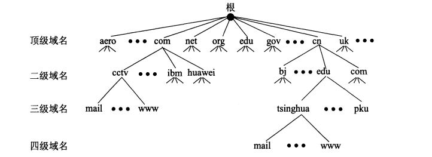

# 概述

## 计算机网络模型

### OSI七层协议

- 表示层
- 会话层

### TCP/IP四层协议

- 网络接口层

  数据链路层和物理层合并为网络接口层

现在的 TCP/IP 体系结构不严格遵循 OSI 分层概念，应用层可能会直接使用 IP 层或者网络接口层。

### 五层协议

- 应用层
- 运输层（传输层）
- 网络层
- 数据链路层
- 物理层

## 数据在各层之间的传递过程

假定主机1的应用进程$AP_1$向主机2的应用进程$AP_2$传送数据。$AP_1$先将其数据交给本主机的第5层(**应用层**)。第5层加上必要的控制信息$H_5$就变成了下一层的数据单元。第4层(**运输层**)收到这个数据单元后，加上本层的控制信息$H_4$，再交给第3层(**网络层**)，成为第3层的数据单元。依此类推。不过到了第2层(**数据链路层**)后，控制信息被分成两部分，分别加到本层数据单元的首部($H_2$)和尾部($T_2$)；而第1层(**物理层**)由于是比特流的传送，所以不再加上控制信息。

> 请注意，**传送比特流时应从首部开始传送。** 
> OSI参考模型把**对等层次之间**传送的数据单位称为该层的**协议数据单元PDU (Protocol Data Unit)。**

当这一串的比特流离开主机1经网络的物理媒体传送到路由器时，就从路由器的第1层依次上升到第3层。每一层都根据控制信息进行必要的操作，然后将控制信息剥去，将该层剩下的数据单元上交给更高的一层。当分组上升到了第3层时，就**根据首部中的目的地址查找路由器中的转发表，找出转发分组的接口**，然后往下传送到第2层，加上**新的**首部和尾部后，再到最下面的第1层，然后在物理媒体上把每一个比特发送出去。 
当这一串的比特流离开路由器到达目的站主机2时，就从主机2的第1层按照上面讲过的方式，依次上升到第5层。最后，把应用进程$AP_1$发送的数据交给目的站的应用进程$AP_2$。

# 物理层

## 通信方式

- 单向通行，又称为单个通信
- 双向交替通信，又称为半双工通信
- 双向同时通信，又称为全双工通信

## 信道复用技术

### 频分复用（FDM）

频分复用的所有用户在相同的时间占用不同的频率带宽资源；

### 时分复用（TDM）

时分复用的所有用户在不同的时间占用相同的频率带宽资源。

### 统计时分复用（STDM）

是对时分复用的一种改进，不固定每个用户在时分复用帧中的位置，只要有数据就集中起来组成统计时分复用帧然后发送。

### 波分复用（WDM）

波分复用是将两种或多种不同的波长的光载波信号在发送端经复用器汇合在一起，并耦合到光线路的同一根光纤中进行传输；在接收端，经复用器将各种波长的光载波分离，然后由光接收机作进一步处理以恢复原信号。这种在同一根光纤中同时传输两个或多个不同波长光信号的技术，称为波分复用。

### 码分复用（CDMA）

为每个用户分配 m bit 的码片，并且所有的码片正交，对于任意两个码片 $\vec{S}$ 和 $\vec{T}$ 有

$$
\frac{1}{m}\vec{S}\cdot\vec{T}=0
$$
为了讨论方便，取 m=8，设码片为 00011011。在拥有该码片的用户发送比特 1 时就发送该码片，发送比特 0 时就发送该码片的反码 11100100。

在计算时将 00011011 记作 (-1 -1 -1 +1 +1 -1 +1 +1)，可以得到
$$
\frac{1}{m}\vec{S}\cdot\vec{S}=1
$$

$$
\frac{1}{m}\vec{S}\cdot\vec{S'}=-1
$$

其中 $\vec{S'}$ 为 $\vec{S}$  的反码。

利用上面的式子我们知道，当接收端使用码片 $\vec{S}$  对接收到的数据进行内积运算时，结果为 0 的是其它用户发送的数据，结果为 1 的是用户发送的比特 1，结果为 -1 的是用户发送的比特 0。

码分复用需要发送的数据量为原先的 m 倍。

# 数据链路层

## 信道分类

- 点对点信道：一对一通信方式；

- 广播信道：一对多通信方式。

## 三个基本问题

### 封装成帧

网络层传下来的分组添加首部和尾部，用于标记帧的开始和结束。

### 透明传输

帧使用首部和尾部进行定界，如果帧的数据部分含有和首部尾部相同的内容，那么帧的开始和结束位置就会被错误的判定。需要在数据部分出现首部尾部相同的内容前面插入转义字符，如果出现转义字符，那么就在转义字符前面再加个转义字符，在接收端进行处理之后可以还原出原始数据。这个过程透明传输的内容是转义字符，用户察觉不到转义字符的存在。

### 差错控制

目前数据链路层广泛使用了循环冗余检验（CRC）来检查比特差错。

## PPP协议（Point to Point Protocol）

用于点对点信道中。互联网用户通常需要连接到某个 ISP 之后才能接入到互联网，PPP 协议是用户计算机和 ISP 进行通信时所使用的数据链路层协议。

在 PPP 的帧中：

- F 字段为帧的定界符
- A 和 C 字段暂时没有意义
- FCS 字段是使用 CRC 的检验序列
- 信息部分的长度不超过 1500

## CSMA/CD 协议

带冲突检测的载波侦听多路访问协议用于广播信道中。在广播信道上，同一时间只能允许一台计算机发送数据。

CSMA/CD 表示载波监听多点接入 / 碰撞检测。

- **多点接入** ：说明这是总线型网络，许多计算机以多点的方式连接到总线上。
- **载波监听** ：每个站都必须不停地监听信道。在发送前，如果监听到信道正在使用，就必须等待。
- **碰撞检测** ：在发送中，如果监听到信道已有其它站正在发送数据，就表示发生了碰撞。虽然每一个站在发送数据之前都已经监听到信道为空闲，但是由于电磁波的传播时延的存在，还是有可能会发生碰撞。

记端到端的传播时延为 τ，最先发送的站点最多经过 2τ 就可以知道是否发生了碰撞，称 2τ 为**争用期** 。只有经过争用期之后还没有检测到碰撞，才能肯定这次发送不会发生碰撞。

当发生碰撞时，站点要停止发送，等待一段时间再发送。这个时间采用**截断二进制指数退避算法**来确定，从离散的整数集合 {0, 1, .., (2k-1)} 中随机取出一个数，记作 r，然后取 r 倍的争用期作为重传等待时间。

## 集线器

传统以太网最初是使用粗同轴电缆，后来演进到使用比较便宜的细同轴电缆，最后发展为使用更便宜和更灵活的双绞线。这种以太网采用星形拓扑，在星形的中心则增加了一种可靠性非常高的设备，叫做集线器（hub）。

## 扩展局域网

### 在物理层进行扩展

使用集线器进行扩展。

集线器的主要功能是对接收到的信号进行放大，以扩大网络的传输距离。

集线器不能根据 MAC 地址进行转发，而是以广播的方式发送数据帧。

集线器是一种共享式的传输设备，意味着同一时刻只能传输一组数据帧。

### 在链路层进行扩展

最开始使用的是网桥，它收到一个帧时，根据帧的 MAC 地址，查找网桥中的地址表，确定帧转发的接口。

网桥不是共享式设备，因此性能比集线器这种共享式设备更高。

交换机的问世很快就淘汰了网桥，它实质上是一个多接口网桥，而网桥是两接口。交换机的每个接口都能直接与一个主机或者另一个交换机相连，并且一般都工作在全双工方式。

交换机具有自学习能力，学习的是交换表的内容。交换表中存储着 MAC 地址到接口的映射。下图中，交换机有 4 个接口，主机 A 向主机 B 发送数据帧时，交换机把主机 A 到接口 1 的映射写入交换表中。为了发送数据帧到 B，先查交换表，此时没有主机 B 的表项，那么主机 A 就发送广播帧，主机 C 和主机 D 会丢弃该帧。主机 B 收下之后，查找交换表得到主机 A 映射的接口为 1，就发送数据帧到接口 1，同时交换机添加主机 B 到接口 3 的映射。

### 虚拟局域网

虚拟局域网可以建立与物理位置无关的逻辑组，只有在同一个虚拟局域网中的成员才会收到链路层广播信息，例如下图中 (A1, A2, A3, A4) 属于一个虚拟局域网，A1 发送的广播会被 A2、A3、A4 收到，而其它站点收不到。

## MAC

MAC 地址是 6 字节（48 位）的地址，用于唯一标识网络适配器（网卡），一台主机拥有多少个适配器就有多少个 MAC 地址，例如笔记本电脑普遍存在无线网络适配器和有线网络适配器。

在 MAC 帧中：

- **类型** ：标记上层使用的协议；
- **数据** ：长度在 46-1500 之间，如果太小则需要填充；
- **FCS** ：帧检验序列，使用的是 CRC 检验方法；
- **前同步码** ：只是为了计算 FCS 临时加入的，计算结束之后会丢弃。

# 网络层

## 网际协议IP

与 IP 协议配套使用的还有三个协议：

- 地址解析协议 ARP（Address Resolution Protocol）

- 网际控制报文协议 ICMP（Internet Control Message Protocol）

- 网际组管理协议 IGMP（Internet Group Management Protocol）

## IP数据报格式

- **版本**  : 有 4（IPv4）和 6（IPv6）两个值；

- **首部长度**  : 占 4 位，因此最大值为 15。值为 1 表示的是 1 个 32 位字的长度，也就是 4 字节。因为首部固定长度为 20 字节，因此该值最小为 5。如果可选字段的长度不是 4 字节的整数倍，就用尾部的填充部分来填充。

- **区分服务**  : 用来获得更好的服务，一般情况下不使用。

- **总长度**  : 包括首部长度和数据部分长度。

- **标识**  : 在数据报长度过长从而发生分片的情况下，相同数据报的不同分片具有相同的标识符。

- **片偏移**  : 和标识符一起，用于发生分片的情况。片偏移的单位为 8 字节。

  

- **生存时间**  ：TTL，它的存在是为了防止无法交付的数据报在互联网中不断兜圈子。以路由器跳数为单位，当 TTL 为 0 时就丢弃数据报。
- **协议** ：指出携带的数据应该上交给哪个协议进行处理，例如 ICMP、TCP、UDP 等。
- **首部检验和** ：因为数据报每经过一个路由器，都要重新计算检验和，因此检验和不包含数据部分可以减少计算的工作量。

## IP地址编址方式

### 分类

由两部分组成，网络号和主机号，其中不同分类具有不同的网络号长度，并且是固定的。

主机号全为0表示网络本身，全为1表示本网络的广播地址；

127.0.0.1网络保留作为环路自检地址，表示任意主机本身；

32bit全为0，即0.0.0.0表示整个TCP/IP网络；

32bit全为1，即255.255.255.255表示整个TCP/IP网络的广播地址。

### 子网划分

通过在主机号字段中拿一部分作为子网号，把两级 IP 地址划分为三级 IP 地址。注意，外部网络看不到子网的存在。

- A类地址的默认子网掩码：255.0.0.0
- B类地址的默认子网掩码：255.255.0.0
- C类地址的默认子网掩码：255.255.255.0

### 无分类编址CIDR

无分类编址 CIDR 消除了传统 A 类、B 类和 C 类地址以及划分子网的概念，使用网络前缀和主机号来对 IP 地址进行编码，网络前缀的长度可以根据需要变化。

使用斜线记法，即A.B.C.D/N，斜线后面的数字就是前缀长度，也就是掩码的长度。

比如192.168.10.0/20包含主机最大地址范围为192.168.0.1~192.168.15.254，因为10对应0001010，其中高4bit为前缀。

## 地址解析协议 ARP

实现由 IP 地址得到 MAC 地址。

每个主机都有一个 ARP 高速缓存，里面有本局域网上的各主机和路由器的 IP 地址到硬件地址的映射表。

如果主机 A 知道主机 B 的 IP 地址，但是 ARP 高速缓存中没有该 IP 地址到 MAC 地址的映射，此时主机 A 通过广播的方式发送 ARP 请求分组，主机 B 收到该请求后会发送 ARP 响应分组给主机 A 告知其 MAC 地址，随后主机 A 向其高速缓存中写入主机 B 的 IP 地址到硬件地址的映射。

## 路由器分组转发流程

1. 从数据报的首部提取目的主机的 IP 地址 D，得到目的网络地址 N。
2. 若 N 就是与此路由器直接相连的某个网络地址，则进行直接交付；
3. 若路由表中有目的地址为 D 的特定主机路由，则把数据报传送给表中所指明的下一跳路由器；
4. 若路由表中有到达网络 N 的路由，则把数据报传送给路由表中所指明的下一跳路由器；
5. 若路由表中有一个默认路由，则把数据报传送给路由表中所指明的默认路由器；
6. 报告转发分组出错。

## 网际控制报文协议 ICMP

ICMP 是为了更有效地转发 IP 数据报和提高交付成功的机会。它封装在 IP 数据报中，但是不属于高层协议。

ICMP 报文分为差错报告报文和询问报文。

### Ping

PING 是 ICMP 的一个重要应用，主要用来测试两台主机之间的连通性。

### Traceroute

Traceroute 是 ICMP 的另一个应用，用来跟踪一个分组从源点到终点的路径。

1. 源主机向目的主机发送一连串的 IP 数据报。第一个数据报 P1 的生存时间 TTL 设置为 1，但 P1 到达路径上的第一个路由器 R1 时，R1 收下它并把 TTL 减 1，此时 TTL 等于 0，R1 就把 P1 丢弃，并向源主机发送一个 ICMP 时间超过差错报告报文；
2. 源主机接着发送第二个数据报 P2，并把 TTL 设置为 2。P2 先到达 R1，R1 收下后把 TTL 减 1 再转发给 R2，R2 收下后也把 TTL 减 1，由于此时 TTL 等于 0，R2 就丢弃 P2，并向源主机发送一个 ICMP 时间超过差错报文。
3. 不断执行这样的步骤，直到最后一个数据报刚刚到达目的主机，主机不转发数据报，也不把 TTL 值减 1。但是因为数据报封装的是无法交付的 UDP，因此目的主机要向源主机发送 ICMP 终点不可达差错报告报文。
4. 之后源主机知道了到达目的主机所经过的路由器 IP 地址以及到达每个路由器的往返时间。

## 虚拟专用网 VPN

由于 IP 地址的紧缺，一个机构能申请到的 IP 地址数往往远小于本机构所拥有的主机数。并且一个机构并不需要把所有的主机接入到外部的互联网中，机构内的计算机可以使用仅在本机构有效的 IP 地址（专用地址）。

有三个专用地址块：

1. 10.0.0.0 \~ 10.255.255.255
2. 172.16.0.0 \~ 172.31.255.255
3. 192.168.0.0 \~ 192.168.255.255

VPN 使用公用的互联网作为本机构各专用网之间的通信载体。专用指机构内的主机只与本机构内的其它主机通信；虚拟指“好像是”，而实际上并不是，它有经过公用的互联网。

下图中，场所 A 和 B 的通信经过互联网，如果场所 A 的主机 X 要和另一个场所 B 的主机 Y 通信，IP 数据报的源地址是 10.1.0.1，目的地址是 10.2.0.3。数据报先发送到与互联网相连的路由器 $R_1$，$R_1$ 对内部数据进行加密，然后重新加上数据报的首部，源地址是路由器 $R_1$的全球地址 125.1.2.3，目的地址是路由器 $R_2$ 的全球地址 194.4.5.6。路由器 $R_2$ 收到数据报后将数据部分进行解密，恢复原来的数据报，此时目的地址为 10.2.0.3，就交付给 Y。

## 网络地址转换 NAT

专用网内部的主机使用本地 IP 地址又想和互联网上的主机通信时，可以使用 NAT 来将本地 IP 转换为全球 IP。

在以前，NAT 将本地 IP 和全球 IP 一一对应，这种方式下拥有 n 个全球 IP 地址的专用网内最多只可以同时有 n 台主机接入互联网。为了更有效地利用全球 IP 地址，现在常用的 NAT 转换表把运输层的端口号也用上了，使得多个专用网内部的主机共用一个全球 IP 地址。使用端口号的 NAT 也叫做网络地址与端口转换 NAPT。

私有IP地址用于LAN，不用于WLAN连接，私有IP地址段如下：

1. 10.0.0.0 \~ 10.255.255.255
2. 172.16.0.0 \~ 172.31.255.255
3. 192.168.0.0 \~ 192.168.255.255

# 运输层（传输层）

## UDP（User Datagram Protocol）

用户数据报协议主要特点：

- UDP 是无连接的，即发送数据之前不需要建立连接。
- UDP 使用尽最大努力交付，即不保证可靠交付，同时也不使用拥塞控制。
- UDP 是面向报文的（几乎不改变报文）。UDP 没有拥塞控制，很适合多媒体通信的要求。
- UDP 支持一对一、一对多、多对一和多对多的交互通信。
- UDP 的首部开销小，只有 8 个字节。

### UDP报文格式

用户数据报 UDP 有两个字段：数据字段和首部字段。首部字段有 8 个字节，由 4 个字段组成，每个字段都是两个字节。 在计算检验和时，临时把“伪首部”和 UDP 用户数据报连接在一起。伪首部仅仅是为了计算检验和。

## TCP（Transmission Control Protocol）

传输控制协议 主要特点：

- TCP 是面向连接的运输层协议。
-  每一条 TCP 连接只能有两个端点(endpoint)，每一条 TCP 连接只能是点对点的（一对一）。
-  有流量控制，拥塞控制
- TCP 提供可靠交付的服务。 
- TCP 提供全双工通信。 
- 面向字节流（把应用层传下来的报文看成字节流，把字节流组织成大小不等的数据块）。

### TCP首部格式

- 源端口和目的端口：各16位；
- 序号和确认号：以字节为单位编号，各32位；
  - TCP 每次发送的报文段的首部中的序号字段数值表示该报文段第一个字节的序号。
  - TCP 确认号表示接收端期望下次收到的数据中的第一个数据字节的序号。
- 数据偏移  ：指的是数据部分距离报文段起始处的偏移量，实际上指的是首部的长度。
- 6位的标识位：
  - **确认 ACK**  ：当 ACK=1 时确认号字段有效，否则无效。TCP 规定，在连接建立后所有传送的报文段都必须把 ACK 置 1。
  - **同步 SYN**  ：在连接建立时用来同步序号。当 SYN=1，ACK=0 时表示这是一个连接请求报文段。若对方同意建立连接，则响应报文中 SYN=1，ACK=1。
  - **终止 FIN**  ：用来释放一个连接，当 FIN=1 时，表示此报文段的发送方的数据已发送完毕，并要求释放运输连接。
  - URG：和紧急指针配合使用，发送紧急数据；
  - PSH：指示发送方和接收方将数据不做缓存，立刻发送或接收；
  - RST：由于不可恢复的错误重置连接；
- 窗口大小：用于基于可变滑动窗口的流控，指示发送方从确认号开始可以再发送窗口大小的字节流；

- 校验和：为增加可靠性，对TCP头，数据和伪头计算校验和；
- 选项字段 —— 长度可变。TCP 最初只规定了一种选项，即最大报文段长度 MSS。MSS 告诉对方 TCP：“我的缓存所能接收的报文段的数据字段的最大长度是 MSS 个字节。

### TCP三次握手

1. A 的 TCP 向 B 发出连接请求报文段，其首部中的同步位 SYN = 1，并选择序号 seq = x，表明传送数据时的第一个数据字节的序号是 x。
2. B 的 TCP 收到连接请求报文段后，如同意，则发回确认。B 在确认报文段中应使 SYN = 1，使 ACK = 1，其确认号ack = x + 1，自己选择的序号 seq = y。
3. A 收到此报文段后向 B 给出确认，其 ACK = 1，确认号 ack = y + 1。A 的 TCP 通知上层应用进程，连接已经建立。
4. B 的 TCP 收到主机 A 的确认后，也通知其上层应用进程：TCP 连接已经建立。

### TCP四次挥手

1. 数据传输结束后，通信的双方都可释放连接。现在 A 的应用进程先向其 TCP 发出连接释放报文段，并停止再发送数据，主动关闭TCP连接。A把连接释放报文段首部的 FIN = 1，其序号seq = u，等待 B 的确认。
2. B 发出确认，确认号 ack = u + 1，而这个报文段自己的序号 seq = v。TCP服务器进程通知高层应用进程。从 A 到 B 这个方向的连接就释放了，TCP 连接处于**半关闭**状态。B 若发送数据，A 仍要接收
3. 若 B 已经没有要向 A 发送的数据，其应用进程就通知 TCP 释放连接。
4. A 收到连接释放报文段后，必须发出确认。

A必须等待2MSL：
第一，为了保证 A 发送的最后一个 ACK 报文段能够到达 B。
第二，防止 “已失效的连接请求报文段”出现在本连接中。A 在发送完最后一个 ACK 报文段后，再经过时间2MSL，就可以使本连接持续的时间内所产生的所有报文段，都从网络中消失。这样就可以使下一个新的连接中不会出现这种旧的连接请求报文段。

### TCP滑动窗口

1. 计算机A和B通信之前先建立TCP连接。并协商参数（如，B告诉A其接收窗口为400字节，A将其发送窗口设置为400字节）
2. 在t1时刻，A发送缓存已放入800字节的数据（假设，一个分组100字节，共8个分组）。由于发送窗口为400字节，首先在窗口内的数据为**第1～4个分组，A会按顺序发送给B**。（注意在没有收到B的确认，就不能从发送窗口中删除这4个分组，因为丢失或错误时需重传）
3. 在t2时刻，B收到四个分组放入缓存中的接收窗口，**按TCP首部的序号排序分组**，当窗口中的分组编号连续时，接收窗口向前移动。应用程序按顺序读取接收窗口外连续的分组数据。
4. **B向A发送一个确认**（ACK=1，ack=401，大写表示TCP首部ACK标记位，小写表示确认号）
5. 在t3时刻，**A收到B的确认，确认号为401，发送窗口向前移动**，401后面（第5～8分组）的字节进入发送窗口。A将发送窗口的数据按顺序发出，并将第1～4分组这些己经确认发送成功的分组从缓存中删除。
6. 第5～8四个分组在发送过程中，**第7个分组丢失或出错误**。
7. 在t4时刻，B收到了5、6、8三个分组。**接收窗口只能向前移动200个字节**，等待第7个分组，**第5、6分组移出接收窗口，应用程序就可以读取这些字节并将其删除**。
8. **B向A发送一个确认**（ack=601），告诉A己经成功接收到600以前的字节，可以从第601字节开始发送。
9. A收到确认后，**发送窗口向前移动200个字节**。这样第9、10个分组进入发送窗口并被发送，第7个分组也会被重传。（注意，**如果双方支持选择确认（SACK）**，那么确认号为601数据包中会包含己经收到的第8个分组的边界，这样**发送方就无须再重复发送第8个分组**。**否则，如果不支持SACK**，**则第8个分组也会被发送**）
10. B收到第7个分组后，接收窗口的分组序号就能连续，接收窗口向前移动，同时给A发送确认，序号为1001。
11. A收到确认后，发送窗口前移，按序发送窗口中的分组。以此类推，直至完成数据发送。

### TCP流量控制

流量控制是为了控制发送方发送速率，保证接收方来得及接收。

接收方发送的确认报文中的窗口字段可以用来控制发送方窗口大小，从而影响发送方的发送速率。将窗口字段设置为 0，则发送方不能发送数据。

### TCP拥塞控制

如果网络出现拥塞，分组将会丢失，此时发送方会继续重传，从而导致网络拥塞程度更高。因此当出现拥塞时，应当控制发送方的速率。这一点和流量控制很像，但是出发点不同。流量控制是为了让接收方能来得及接受，而拥塞控制是为了降低整个网络的拥塞程度。

TCP 主要通过四种算法来进行拥塞控制：慢开始、拥塞避免、快重传、快恢复。发送方需要维护一个叫做拥塞窗口（cwnd）的状态变量。注意拥塞窗口与发送方窗口的区别，拥塞窗口只是一个状态变量，实际决定发送方能发送多少数据的是发送方窗口。

为了便于讨论，做如下假设：

1. 接收方有足够大的接收缓存，因此不会发生流量控制；
2. 虽然 TCP 的窗口基于字节，但是这里设窗口的大小单位为报文段。

#### 慢开始与拥塞避免

发送的最初执行慢开始，令 cwnd=1，发送方只能发送 1 个报文段；当收到确认后，将 cwnd 加倍，因此之后发送方能够发送的报文段数量为：2、4、8 ...

注意到慢开始每个轮次都将 cwnd 加倍，这样会让 cwnd 增长速度非常快，从而使得发送方发送的速度增长速度过快，网络拥塞的可能也就更高。设置一个慢开始门限 ssthresh，当 cwnd >= ssthresh 时，进入拥塞避免，每个轮次只将 cwnd 加 1。

如果出现了超时，则令 ssthresh = cwnd/2，然后重新执行慢开始。

使用慢开始的法感知网络状态，先发送一个分组，测试一下网络是否拥堵，如果收到确认（也就是没重传），再进一步提高发送速度，这就是慢开始。等出现丢包现象，就可以断定网络出现拥塞，在放慢增速，这就是拥塞避免。

#### 快重传与快恢复

在接收方，要求每次接收到报文段都应该发送对已收到有序报文段的确认，例如已经接收到 M1 和 M2，此时收到 M4，应当发送对 M2 的确认。

在发送方，如果收到三个重复确认，那么可以确认下一个报文段丢失，例如收到三个 M2 ，则 M3 丢失。此时执行快重传，立即重传下一个报文段。

在这种情况下，只是丢失个别报文段，而不是网络拥塞，因此执行快恢复，令 ssthresh = cwnd/2 ，cwnd = ssthresh，注意到此时直接进入拥塞避免。

# 应用层

## 域名系统DNS

### 层次结构

一个域名由多个层次构成，从上层到下层分别为顶级域名、二级域名、三级域名以及四级域名。所有域名可以画成一颗域名树。

域名服务器可以分为以下四类：

1. 根域名服务器：解析顶级域名；
2. 顶级域名服务器：解析二级域名；
3. 权限域名服务器：解析区内的域名；
4. 本地域名服务器：也称为默认域名服务器。可以在其中配置高速缓存。

### 解析过程

主机向本地域名服务器解析的过程采用递归，而本地域名服务器向其它域名服务器解析可以使用递归和迭代两种方式。

迭代的方式下，本地域名服务器向一个域名服务器解析请求解析之后，结果返回到本地域名服务器，然后本地域名服务器继续向其它域名服务器请求解析；而递归的方式下，结果不是直接返回的，而是继续向前请求解析，最后的结果才会返回。

### 使用的运输层协议

DNS 在解析的过程使用 UDP 进行传输，因为 UDP 最大只支持 512 字节的数据，如果超过的话就需要使用 TCP 传输。

## 文件传输协议FTP

FTP 在运输层使用 TCP，并且需要建立两个并行的 TCP 连接：控制连接和数据连接。控制连接在整个会话期间一直保持打开，而数据连接在数据传送完毕之后就关闭。控制连接使用端口号 21，数据连接使用端口号 20。

## 远程终端协议TELNET

TELNET 用于登录到远程主机上，并且远程主机上的输出也会返回。

TELNET 可以适应许多计算机和操作系统的差异，例如不同操作系统系统的换行符定义。

## 电子邮件协议

### 发送协议SMTP

SMTP 只能发送 ASCII 码，而互联网邮件扩充 MIME 可以发送二进制文件。MIME 并没有改动或者取代 SMTP，而是增加邮件主题的结构，定义了非 ASCII 码的编码规则。

### 读取协议POP3和IMAP

POP3 的特点是只要用户从服务器上读取了邮件，就把该邮件删除。

IMAP 协议中客户端和服务器上的邮件保持同步，如果不去手动删除邮件，那么服务器上的邮件也不会被删除。IMAP 这种做法可以让用户随时随地去访问服务器上的邮件。IMAP 协议也支持创建自定义的文件夹。

## 动态主机配置协议DHCP

DHCP 提供了即插即用的连网方式，用户不再需要去手动配置 IP 地址等信息。

DHCP 配置的内容不仅是 IP 地址，还包括子网掩码、默认路由器 IP 地址、域名服务器的 IP 地址。

工作方式如下：需要 IP 地址的主机广播发送 DHCP 发现报文（将目的地址置为全 1，即 255.255.255.255:67，源地址设置为全 0，即 0.0.0.0:68），DHCP 服务器收到发现报文之后，则在 IP 地址池中取一个地址，发送 DHCP 提供报文给该主机。