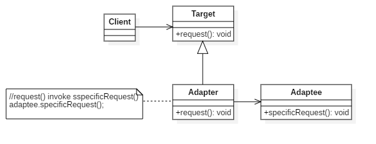

# 适应设计模式

## Iterator迭代器模式——一个个遍历

迭代器用于顺序访问集合对象中的元素，而无须了解其内部结构。

### UML 结构图


- 迭代器（Iterator）：实现一个用于定义迭代器接口，负责逐个遍历元素；
- 具体迭代器（ConcreteIterator）：迭代器的实现；
- 抽象容器（Container）：定义聚合关系的接口，负责创建迭代器角色；
- 具体容器（ConcreteContainer）：聚合关系的实现。

### 示例程序


```java
public interface Aggregate{
    public abstract Iterator iterator();
}

public class BookShelf implements Aggragate{
    private Book[] books;
    private int last = 0;
    public BookShelf(int maxSize){
        this.books = new Book(maxSize);
    }
    public Book getBook(int index){
        return books[index];
    }
    public void appendBook(Book book){
        this.books[last] = book;
        last++;
    }
    public int getLength(){
        return last;
    }
}

public class Book{
    private String name;
    public Book(String name){
        this.name = name;
    }
    public String getName(){
        return name;
    }
}
```

```java
public interface Itetator{
    public abstract boolean hasNext();
    public abstract Object next();
}

public class BookShelfIterator implements Iterator{
    private BookShelf bookShelf;
    private int index;
    public BookShelfItetator(BookShelf bookShelf){
        this.bookShelf = bookShelf;
        this.index = 0;
    }
    public boolean hasNext(){
        if(index < bookShelf.getLength()){
            return true;
        }else{
            return false;
        }
    }
    public Object next(){
        Book book = bookShelf.getBookAt(index);
        index++;
        return book;
    }
}
```

```java
public class IteratorDemo{
    public static void main(String[] args){
        BookShelf bookShelf = new BookShelf(4);
        booShelf.appendBook("Book1");
        booShelf.appendBook("Book2");
        booShelf.appendBook("Book3");
        booShelf.appendBook("Book4");
        
        Iterator it = bookShlef.itetator();
        while(it.hasNext()){
            Book book = (Book)it.next();
            System.out.println(book.getName());
        }
    }
}
```

```
Book1
Book2
Book3
Book4
```

### 现实用例

## Adapter适配器模式——加个“适配器”以便于复用

允许我们为一个已有的类提供一个新的接口，并在客户端请求不同接口时实现类的重用。

Adapter模式有以下两种：

- 类适配器模式（使用继承的适配器）
- 对象适配器模式（使用委托的适配器）

我们可以在以下情况使用适配器模式：

- 我们想要使用现有的类，但它的接口不符合我们的需要；
- 我们想要创建一个可重用的类，能够与一些无关的类或不可预见的类进行写作，同时这个类无须具有兼容的接口。
- 我们需要使用多个已经存在的子类，而我们为每一个子类都做接口适配显然是不切实际的，使用对象适配器可以直接适配其父类的接口。

### UML 结构图



- 客户端（Client）：调用目标类的类或程序；
- 目标类（Target）：客户端想要使用的接口；
- 适配器对象类（Adaptee）：需要进行适配的类或对象；
- 适配器类（Adapter）：按照目标类接口的要求对适配对象接口实现接口形式的适配转换；
- request方法：客户端想要执行的操作；
- specificRequest方法：适配对象中能够完成request方法功能的实现。

### Java实现

### 示例程序

#### 使用继承的适配器


```java
public class Banner {
    private String str;
    public Banner(String str) {
        this.str = str;
    }
    public void showWithParen() {
       System.out.println("(" + str + ")");
    }
    public void showWithAster() {
       System.out.println("*" + str + "*");
    }
}

public interface Print {
    public abstract void printWeak();
    public abstract void printStrong();
}

public class PrintBanner extends Banner implements Print {
    public PrintBanner(String str) {
        super(str);
    }
    public void printWeak() {
        showWithParen();
    }
    public void printStrong() {
       showWithAster();
    }
}

public class Main {
    public static void main(String[] args) {
        Print p = new PrintBanner("Hello");
        p.printWeak();
        p.printStrong();
    }
}
```

```
(Hello)
*Hello*
```

#### 使用委托的适配器


```java
public class Print {
    public abstract void printWeak();
    public abstract void printStrong();
}

public class PrintBanner extends Print {
    private Banner banner;
    public PrintBanner(String str) {
        this.banner = new Banner (str)
    }
    public void printWeak() {
        showWithParen();
    }
    public void printStrong() {
       showWithAster();
    }
}
```

### 现实用例

# 交给子类

## Template Method模版方法模式——将具体处理交给子类

将算法中的部分步骤延迟到子类中进行计算。

### UML 结构图


### 示例程序


```java
public abstract class Game {
   abstract void initialize();
   abstract void startPlay();
   abstract void endPlay();

   //template method
   public final void play(){

      //initialize the game
      initialize();

      //start game
      startPlay();

      //end game
      endPlay();
   }
}

public class Basketball extends Game {

   @Override
   void endPlay() {
      System.out.println("Cricket Game Finished!");
   }

   @Override
   void initialize() {
      System.out.println("Cricket Game Initialized! Start playing.");
   }

   @Override
   void startPlay() {
      System.out.println("Cricket Game Started. Enjoy the game!");
   }
}

public class Football extends Game {

   @Override
   void endPlay() {
      System.out.println("Football Game Finished!");
   }

   @Override
   void initialize() {
      System.out.println("Football Game Initialized! Start playing.");
   }

   @Override
   void startPlay() {
      System.out.println("Football Game Started. Enjoy the game!");
   }
}
```

```java
public class TemplatePatternDemo {
   public static void main(String[] args) {

      Game game = new Cricket();
      game.play();
      System.out.println();
      game = new Football();
      game.play();		
   }
}
```

```
Cricket Game Initialized! Start playing.
Cricket Game Started. Enjoy the game!
Cricket Game Finished!

Football Game Initialized! Start playing.
Football Game Started. Enjoy the game!
Football Game Finished!
```

### 现实用例

## Factory Method工厂方法模式——将实例的生成交给子类

定义一个创建对象的接口，但由子类决定要实例化哪个类。

工厂方法模式的功能及应用场景：

- 当需要创建一个类，而在编程时不能确定这个类的类型时（需要运行时确定）；
- 当一个类希望由其子类来指定所创建对象的具体类型时；
- 当我们想要定位被创建类，并获取相关信息时。

比如日志记录功能，它可能有很多不同的用途，例如文件日志、数据库日志、控制台日志记录等。

### UML 结构图


- 产品类（Product）：定义了工厂方法创建的对象接口；
- 具体产品类（ConcreteProduct）：实现产品类接口；
- 工厂类（Factory）：声明工厂方法，返回以恶搞产品类对象，可用于调用创建产品类对象的生成方法；
- 具体工厂类（ConcreteFactory）：重写用于创建具体产品类对象的方法。

### Java实现

```java
public interface Product{
    
}

public class ConcreteProduct implements Product{
    
}

public class ConcreteProduct1 implements Product{
    
}
```

```java
public abstract class Factory {
    abstract public Product factoryMethod();
    public void doSomethind() {
        Product product = factoryMethod();
        // do something with the product
    }
}
```

```java
public class ConcreteFactory extends Factory {
    public Product factoryMethod() {
        return new ConcreteProduct();
    }
}
```

```java
public class ConcreteFactory1 extends Factory{
    public Product factoryMethod() {
        return new ConcreteProduct1();
    }
}
```

### 示例程序


```java
public interface Shape {
   void draw();
}

public class Rectangle implements Shape {

   @Override
   public void draw() {
      System.out.println("Inside Rectangle::draw() method.");
   }
}

public class Square implements Shape {

   @Override
   public void draw() {
      System.out.println("Inside Square::draw() method.");
   }
}

public class Circle implements Shape {

   @Override
   public void draw() {
      System.out.println("Inside Circle::draw() method.");
   }
}

public class ShapeFactory {
	
   //use getShape method to get object of type shape 
   public Shape getShape(String shapeType){
      if(shapeType == null){
         return null;
      }		
      if(shapeType.equalsIgnoreCase("CIRCLE")){
         return new Circle();
         
      } else if(shapeType.equalsIgnoreCase("RECTANGLE")){
         return new Rectangle();
         
      } else if(shapeType.equalsIgnoreCase("SQUARE")){
         return new Square();
      }
      
      return null;
   }
}
```

```java
public class FactoryMethodDemo {

   public static void main(String[] args) {
      ShapeFactory shapeFactory = new ShapeFactory();

      //get an object of Circle and call its draw method.
      Shape shape1 = shapeFactory.getShape("CIRCLE");

      //call draw method of Circle
      shape1.draw();

      //get an object of Rectangle and call its draw method.
      Shape shape2 = shapeFactory.getShape("RECTANGLE");

      //call draw method of Rectangle
      shape2.draw();

      //get an object of Square and call its draw method.
      Shape shape3 = shapeFactory.getShape("SQUARE");

      //call draw method of square
      shape3.draw();
   }
}
```

```
Inside Circle::draw() method.
Inside Rectangle::draw() method.
Inside Square::draw() method.
```

### 现实用例

# 生成实例

## Singleton单例模式——只有一个实例

确保一个类仅有一个实例，并提供一个全局访问点。

单例模式的要点有三个：

- 单例类有且仅有一个实例；
- 单例类必须自行创建自己的唯一实例；
- 单例类必须给所有其他对象提供这一实例。

### UML 结构图


### Java实现

#### 懒汉式-线程不安全

在程序运行到需要用到该类的实例化时，instance()方法才去判断单例instance，进而实例化单例instance，让人它有一种懒惰，不到最后关头不实例化的感觉，故得名。

```java
public class Singleton {
    private static Singleton instance;
    private Singleton(){}
    public static Singleton getInstance(){
        if (instance == null) {
            instance = new Singleton();
        }
        return instance;
    }
}
```

假设两个线程同时首次调用该类的静态方法instance()，即它们会同时判断instance是否为NULL，则这两个线程会各自实例instance，出现错误。

#### 饿汉式-线程安全

无论是否调用该类的实例，在程序开始时就会产生一个该类的实例，并在之后程序中仅返回该单例。静态实例初始化在程序开始时进入主函数之前就由主线程以单线程方式完成了初始化。可以不用考虑多线程的问题。因此这种模式在性能需求较高时，可避免频繁的锁竞争。

```java
public class Singleton {
    private static Singleton instance=new Singleton();
    private Singleton(){}
    public static Singleton getInstance(){
        return instance;
    }
}
```

#### 懒汉式-线程安全

设计线程安全问题，可以加锁保护。加锁就是确保当一个线程位于代码的临界区时，另一个线程不进入临界区。如果其他线程试图进入锁定的代码，则它将一直等待，直到该对象被释放。

```java
public class Singleton {
    private static Singleton instance;
    private Singleton(){}
    public synchronized static Singleton getInstance(){
        if (instance == null) {
            instance = new Singleton();
        }
        return instance;
    }
}
//上面的使用成本有点高，为了避免对整个方法进行同步，仅对关键字代码进行同步
public class Singleton {
    private static Singleton instance;
    private Singleton(){}
    public static Singleton getInstance(){
        if (instance == null) {
            synchronized(Singleton.class){
                instance = new Singleton();
            }            
        }
        return instance;
    }
}
```

#### 双重同步锁-线程安全

考虑一下场景：线程1进入同步代码段中，但它能够实例化单例类之前，线程被抢占。随后，另一个线程进入if代码段。虽然这时第二个线程需要等待第一个线程完成之前的运算，但我们仍然会创建两个不同的单一实例。这时可以采用双重同步锁来解决这一问题。

```java
public class Singleton {
    private static Singleton instance;
    private Singleton(){}
    public static Singleton getInstance(){
        if (instance == null) {
            synchronized(Singleton.class){
                if (instance == null){
                    instance = new Singleton();
                }               
            }            
        }
        return instance;
    }
}
```

### 现实用例

## Prototype原型模式——通过复制生成实例

使用一个原型实例来指定创建对象的种类，然后通过拷贝这些原型实现新对象的创建。

相比于以往创建一个复杂对象总是耗时费力，原型模式只需要复制现有的相似对象，并根据需要做适当修改。

克隆方法是一种复制对象的操作。克隆出的对象副本被初始化为调用克隆方法时原始对象的当前状态。这意味着对象的克隆避免了创建新对象。

克隆对象会涉及浅层复制和深层复制的概念。

- **浅层复制**：当原始对象变化时，新对象也跟着改变。这主要是因为浅层复制并没有实际复制新的对象，而只是对原有对象的一个引用。
- **深层复制**：当原始对象变化时，新对象不受影响，因为原始对象所包含的所有参数、对象和引用在复制新对象的过程中都建立了新的拷贝。

### UML 结构图


- 客户端（Client）：通过调用原型类的克隆操作创建一个新对象；
- 原型类（Prototype）：声明一个接口用于克隆自己；
- 具体原型类（ConcretePrototype）：实现克隆自己的操作。

### Java实现

```java
public interface Prototype{
    public abstract Object clone();
}

public class ConcretePrototype implements Prototype{
    public Object clone(){
        return super.clone();
    }
}

public class Client{
    public static void main(String arg[]){
        ConcretePrototype obj1= new ConcretePrototype ();
		ConcretePrototype obj2 = (ConcretePrototype)obj1.clone();
    }
}
```

### 示例程序


```java
public abstract class Shape implements Cloneable {
   
   private String id;
   protected String type;
   
   abstract void draw();
   
   public String getType(){
      return type;
   }
   
   public String getId() {
      return id;
   }
   
   public void setId(String id) {
      this.id = id;
   }
   
   public Object clone() {
      Object clone = null;
      
      try {
         clone = super.clone();
         
      } catch (CloneNotSupportedException e) {
         e.printStackTrace();
      }
      
      return clone;
   }
}

public class Rectangle extends Shape {

   public Rectangle(){
     type = "Rectangle";
   }

   @Override
   public void draw() {
      System.out.println("Inside Rectangle::draw() method.");
   }
}

public class Square extends Shape {

   public Square(){
     type = "Square";
   }

   @Override
   public void draw() {
      System.out.println("Inside Square::draw() method.");
   }
}

public class Circle extends Shape {

   public Circle(){
     type = "Circle";
   }

   @Override
   public void draw() {
      System.out.println("Inside Circle::draw() method.");
   }
}
```

```java
import java.util.Hashtable;

public class ShapeCache {
	
   private static Hashtable<String, Shape> shapeMap  = new Hashtable<String, Shape>();

   public static Shape getShape(String shapeId) {
      Shape cachedShape = shapeMap.get(shapeId);
      return (Shape) cachedShape.clone();
   }

   // for each shape run database query and create shape
   // shapeMap.put(shapeKey, shape);
   // for example, we are adding three shapes
   //产生三个原型，后面的都从这克隆
   public static void loadCache() {
      Circle circle = new Circle();
      circle.setId("1");
      shapeMap.put(circle.getId(),circle);

      Square square = new Square();
      square.setId("2");
      shapeMap.put(square.getId(),square);

      Rectangle rectangle = new Rectangle();
      rectangle.setId("3");
      shapeMap.put(rectangle.getId(), rectangle);
   }
}
```

```java
public class PrototypePatternDemo {
   public static void main(String[] args) {
      ShapeCache.loadCache();

      Shape clonedShape = (Shape) ShapeCache.getShape("1");
      System.out.println("Shape : " + clonedShape.getType());		

      Shape clonedShape2 = (Shape) ShapeCache.getShape("2");
      System.out.println("Shape : " + clonedShape2.getType());		

      Shape clonedShape3 = (Shape) ShapeCache.getShape("3");
      System.out.println("Shape : " + clonedShape3.getType());		
   }
}
```

```
Shape : Circle
Shape : Square
Shape : Rectangle
```

### 现实用例

## Builder建造者模式——组装复杂的实例

将复杂对象的构建与其表示相互分离，使得在同样的构建过程中可以创建不同的表示。建造者模式隐藏了产品构建过程中的内部细节。各个建造者之间都是相互独立的。

### UML 结构图


- 生成器类(Builder)：提供一个接口用于创建产品的各个组成部件。
- 具体生成器（ConcreteBuilder）：跟踪其所创建对象的表示形式，并在创建对象的同时提供一个接口获取产品
- 导演类（Director）通过生成器提供的接口构造对象。

### Java实现

```java
public class Builder {
    public Builder() {
    }

    public void builderPart() {
        // TODO implement here
    }
}

public class ConcreteBuilder extends Builder {

    public ConcreteBuilder() {
    }

    public void builderPart() {
        // TODO implement here
    }

    public Product getResult() {
        // TODO implement here
    }
}

public class Director {
    public Director() {
    }

    public void construct(Builder builder) {
        // TODO implement here
    }

}

public class Product {
    public Product() {
    }
}
```

### 示例程序


```java
public interface Item {
   public String name();
   public Packing packing();
   public float price();	
}

public interface Packing {
   public String pack();
}

public class Wrapper implements Packing {

   @Override
   public String pack() {
      return "Wrapper";
   }
}

public class Bottle implements Packing {

   @Override
   public String pack() {
      return "Bottle";
   }
}

public abstract class Burger implements Item {

   @Override
   public Packing packing() {
      return new Wrapper();
   }

   @Override
   public abstract float price();
}

public abstract class ColdDrink implements Item {

	@Override
	public Packing packing() {
       return new Bottle();
	}

	@Override
	public abstract float price();
}

public class VegBurger extends Burger {

   @Override
   public float price() {
      return 25.0f;
   }

   @Override
   public String name() {
      return "Veg Burger";
   }
}

public class ChickenBurger extends Burger {

   @Override
   public float price() {
      return 50.5f;
   }

   @Override
   public String name() {
      return "Chicken Burger";
   }
}

public class Coke extends ColdDrink {

   @Override
   public float price() {
      return 30.0f;
   }

   @Override
   public String name() {
      return "Coke";
   }
}

public class Pepsi extends ColdDrink {

   @Override
   public float price() {
      return 35.0f;
   }

   @Override
   public String name() {
      return "Pepsi";
   }
}
```

```java
import java.util.ArrayList;
import java.util.List;

public class Meal {
   private List<Item> items = new ArrayList<Item>();	

   public void addItem(Item item){
      items.add(item);
   }

   public float getCost(){
      float cost = 0.0f;
      
      for (Item item : items) {
         cost += item.price();
      }		
      return cost;
   }

   public void showItems(){
   
      for (Item item : items) {
         System.out.print("Item : " + item.name());
         System.out.print(", Packing : " + item.packing().pack());
         System.out.println(", Price : " + item.price());
      }		
   }	
}
```

```java
public class MealBuilder {

   public Meal prepareVegMeal (){
      Meal meal = new Meal();
      meal.addItem(new VegBurger());
      meal.addItem(new Coke());
      return meal;
   }   

   public Meal prepareNonVegMeal (){
      Meal meal = new Meal();
      meal.addItem(new ChickenBurger());
      meal.addItem(new Pepsi());
      return meal;
   }
}
```

```java
public class BuilderPatternDemo {
   public static void main(String[] args) {
   
      MealBuilder mealBuilder = new MealBuilder();

      Meal vegMeal = mealBuilder.prepareVegMeal();
      System.out.println("Veg Meal");
      vegMeal.showItems();
      System.out.println("Total Cost: " + vegMeal.getCost());

      Meal nonVegMeal = mealBuilder.prepareNonVegMeal();
      System.out.println("\n\nNon-Veg Meal");
      nonVegMeal.showItems();
      System.out.println("Total Cost: " + nonVegMeal.getCost());
   }
}
```

```
Veg Meal
Item : Veg Burger, Packing : Wrapper, Price : 25.0
Item : Coke, Packing : Bottle, Price : 30.0
Total Cost: 55.0


Non-Veg Meal
Item : Chicken Burger, Packing : Wrapper, Price : 50.5
Item : Pepsi, Packing : Bottle, Price : 35.0
Total Cost: 85.5
```

### 现实用例

## Abstract Factory抽象工厂模式——将关联零件组装成产品

提供一个用于创建一系列相关对象或相互依赖对象的接口，无须指定对象的具体类。

抽象工厂模式创建的是对象家族，也就是很多对象而不是一个对象，并且这些对象是相关的，也就是说必须一起创建出来。而工厂模式只是用于创建一个对象，这和抽象工厂模式有很大不同。

### UML 结构图


- 抽象工厂（AbstractFactory）：声明一个用于完成抽象产品对象创建操作的接口；
- 具体工厂（ConcreteFactory）：实现创建具体产品对象的操作；
- 抽象产品（AbstractProduct）：声明一个用于一类产品对象的接口；
- 具体产品（ConcreteProduct）：定义由相应的具体工厂来创建的产品对象；
- 客户端（Client）：使用由抽象工厂和抽象产品类声明的唯一接口。

### Java实现

```java
public class AbstractProductA {
}
```

```java
public class AbstractProductB {
}
```

```java
public class ProductA1 extends AbstractProductA {
}
```

```java
public class ProductA2 extends AbstractProductA {
}
```

```java
public class ProductB1 extends AbstractProductB{
}
```

```java
public class ProductB2 extends AbstractProductB{
}
```

```java
public abstract class AbstractFactory {
    abstract AbstractProductA createProductA();
    abstract AbstractProductB createProductB();
}
```

```java
public class ConcreteFactory1 extends AbstractFactory{
    AbstractProductA createProductA() {
        return new ProductA1();
    }

    AbstractProductB createProductB() {
        return new ProductB1();
    }
}
```

```java
public class ConcreteFactory2 extends AbstractFactory {
    AbstractProductA createProductA() {
        return new ProductA2();
    }

    AbstractProductB createProductB() {
        return new ProductB2();
    }
}
```

```java
public class Client {
    public static void main(String[] args) {
        AbstractFactory abstractFactory = new ConcreteFactory1();
        AbstractProductA productA = abstractFactory.createProductA();
        abstractFactory = new ConcreteFactory2();
        productA = abstractFactory.createProductA();
    }
}
```

### 示例程序


```java
public interface Shape {
   void draw();
}

public class Rectangle implements Shape {

   @Override
   public void draw() {
      System.out.println("Inside Rectangle::draw() method.");
   }
}

public class Square implements Shape {

   @Override
   public void draw() {
      System.out.println("Inside Square::draw() method.");
   }
}

public class Circle implements Shape {

   @Override
   public void draw() {
      System.out.println("Inside Circle::draw() method.");
   }
}
```

```java
public interface Color {
   void fill();
}

public class Red implements Color {

   @Override
   public void fill() {
      System.out.println("Inside Red::fill() method.");
   }
}

public class Green implements Color {

   @Override
   public void fill() {
      System.out.println("Inside Green::fill() method.");
   }
}

public class Blue implements Color {

   @Override
   public void fill() {
      System.out.println("Inside Blue::fill() method.");
   }
}
```

```java
public abstract class AbstractFactory {
   abstract Color getColor(String color);
   abstract Shape getShape(String shape) ;
}

public class ShapeFactory extends AbstractFactory {
	
   @Override
   public Shape getShape(String shapeType){
   
      if(shapeType == null){
         return null;
      }		
      
      if(shapeType.equalsIgnoreCase("CIRCLE")){
         return new Circle();
         
      }else if(shapeType.equalsIgnoreCase("RECTANGLE")){
         return new Rectangle();
         
      }else if(shapeType.equalsIgnoreCase("SQUARE")){
         return new Square();
      }
      
      return null;
   }
   
   @Override
   Color getColor(String color) {
      return null;
   }
}

public class ColorFactory extends AbstractFactory {
	
   @Override
   public Shape getShape(String shapeType){
      return null;
   }
   
   @Override
   Color getColor(String color) {
   
      if(color == null){
         return null;
      }		
      
      if(color.equalsIgnoreCase("RED")){
         return new Red();
         
      }else if(color.equalsIgnoreCase("GREEN")){
         return new Green();
         
      }else if(color.equalsIgnoreCase("BLUE")){
         return new Blue();
      }
      
      return null;
   }
}
```

```java
public class FactoryProducer {
   public static AbstractFactory getFactory(String choice){
   
      if(choice.equalsIgnoreCase("SHAPE")){
         return new ShapeFactory();
         
      }else if(choice.equalsIgnoreCase("COLOR")){
         return new ColorFactory();
      }
      
      return null;
   }
}

public class AbstractFactoryPatternDemo {
   public static void main(String[] args) {

      //get shape factory
      AbstractFactory shapeFactory = FactoryProducer.getFactory("SHAPE");

      //get an object of Shape Circle
      Shape shape1 = shapeFactory.getShape("CIRCLE");

      //call draw method of Shape Circle
      shape1.draw();

      //get an object of Shape Rectangle
      Shape shape2 = shapeFactory.getShape("RECTANGLE");

      //call draw method of Shape Rectangle
      shape2.draw();
      
      //get an object of Shape Square 
      Shape shape3 = shapeFactory.getShape("SQUARE");

      //call draw method of Shape Square
      shape3.draw();

      //get color factory
      AbstractFactory colorFactory = FactoryProducer.getFactory("COLOR");

      //get an object of Color Red
      Color color1 = colorFactory.getColor("RED");

      //call fill method of Red
      color1.fill();

      //get an object of Color Green
      Color color2 = colorFactory.getColor("Green");

      //call fill method of Green
      color2.fill();

      //get an object of Color Blue
      Color color3 = colorFactory.getColor("BLUE");

      //call fill method of Color Blue
      color3.fill();
   }
}
```

```
Inside Circle::draw() method.
Inside Rectangle::draw() method.
Inside Square::draw() method.
Inside Red::fill() method.
Inside Green::fill() method.
Inside Blue::fill() method.
```

### 现实用例

# 分开考虑

## Bridge桥接模式——将类的功能层次结构与实现层次结构分离

允许我们将类与其接口相互解耦。允许类及其接口随着时间相互独立变化，增加类重用的次数，提高后续可扩展性。它也允许运行时对接口的不同实现方式动态切换，使代码更加灵活。

### UML 结构图


- 抽象化对象（Abstraction）：桥接设计模式的核心，定义了关键的功能；
- 扩展后的抽象化对象（RefinedAbstraction）：将抽象化对象细化到新的层次；
- 实现化对象（Implementor）：该接口比抽象化对象的层次更高，只对基本操作进行定义；
- 具体实现化对象（ConcreteImplementor）：通过提供具体实现来执行实现化对象的具体功能。

### 示例程序


```java
public abstract class DrawAPI {
   public void drawCircle(int radius, int x, int y);
}

public class RedCircle extends DrawAPI {
   @Override
   public void drawCircle(int radius, int x, int y) {
      System.out.println("Drawing Circle[ color: red, radius: " + radius + ", x: " + x + ", " + y + "]");
   }
}

public class RedCircle extends DrawAPI {
   @Override
   public void drawCircle(int radius, int x, int y) {
      System.out.println("Drawing Circle[ color: red, radius: " + radius + ", x: " + x + ", " + y + "]");
   }
}
```

```java
public abstract class Shape {
   protected DrawAPI drawAPI;
   
   protected Shape(DrawAPI drawAPI){
      this.drawAPI = drawAPI;
   }
   public abstract void draw();	
}

public class Circle extends Shape {
   private int x, y, radius;

   public Circle(int x, int y, int radius, DrawAPI drawAPI) {
      super(drawAPI);
      this.x = x;  
      this.y = y;  
      this.radius = radius;
   }

   public void draw() {
      drawAPI.drawCircle(radius,x,y);
   }
}
```

```java
public class BridgePatternDemo {
   public static void main(String[] args) {
      Shape redCircle = new Circle(100,100, 10, new RedCircle());
      Shape greenCircle = new Circle(100,100, 10, new GreenCircle());

      redCircle.draw();
      greenCircle.draw();
   }
}
```

```
Drawing Circle[ color: red, radius: 10, x: 100, 100]
Drawing Circle[  color: green, radius: 10, x: 100, 100]
```

### 现实用例

## Strategy策略模式——整体地替换算法

在类中进行算法封装。

### UML 结构图


- 抽象策略类（Strategy）：定义一个所有算法都支持的通用接口。内容类会使用这个接口来调用由具体策略类定义的各个算法。
- 具体策略类（ConcreteStrategy）：每个具体策略类都会实现一个相应的算法。
- 内容类（Context）：包含一个策略对象的引用。

### 示例程序


```java
public  abstract class Strategy {
   public int doOperation(int num1, int num2);
}

public class OperationAdd extends Strategy{
   @Override
   public int doOperation(int num1, int num2) {
      return num1 + num2;
   }
}

public class OperationSubstract extends Strategy{
   @Override
   public int doOperation(int num1, int num2) {
      return num1 - num2;
   }
}
```

```java
public class Context {
   private Strategy strategy;

   public Context(Strategy strategy){
      this.strategy = strategy;
   }

   public int executeStrategy(int num1, int num2){
      return strategy.doOperation(num1, num2);
   }
}
```

```java
public class StrategyPatternDemo {
   public static void main(String[] args) {
      Context context = new Context(new OperationAdd());		
      System.out.println("10 + 5 = " + context.executeStrategy(10, 5));

      context = new Context(new OperationSubstract());		
      System.out.println("10 - 5 = " + context.executeStrategy(10, 5));
   }
}
```

```
10 + 5 = 15
10 - 5 = 5
```

### 现实用例

# 一致性

## Composite组合模式——容器与内容的一致性

它能够为客户端处理各种复杂和灵活的树状结构。这些数结构可以由各种不同类型的容器和叶结点组成，其深度或组合形式能够在运行时调整或确定。

### UML 结构图

### Java实现

### 示例程序

### 现实用例

## Decorator装饰者模式——装饰边框与被装饰物的一致性

允许我们通过附加新的功能或修改现有功能，在运行时动态地修改对象。

### UML 结构图

### Java实现

### 示例程序

### 现实用例

# 访问数据结构

## Visitor访问者模式——访问数据结构并处理数据

在不改变类的条件下为该类定义一个新的操作。

### UML 结构图

### Java实现

### 示例程序

### 现实用例

## Chain of Responsibility职责链模式——推卸责任

在一系列对象链之间传递请求的方法。

### UML 结构图

### Java实现

### 示例程序

### 现实用例

# 简单化

## Facade外观模式——简单窗口

允许我们为客户端创建一个统一的接口以访问不同子系统的不同接口，从而简化客户端。

### UML 结构图

### Java实现

### 示例程序

### 现实用例

## Mediator中介者模式——只有一个仲裁者

定义简单的类间通信。

### UML 结构图

### Java实现

### 示例程序

### 现实用例

# 管理状态

## Observer观察者模式——发送状态变化通知

观察者模式主要用于解决对象之间一对多的关系，当一个对象改变时会告知许多关联对象。  

我们在下列情况下使用观察者模式：

-  当一个对象的改变需要其他对象同时改变，而我们并不指导需要有多少个对象一起改变时。
- 当一个对象必须通知其他对象，而无须了解这些对象是谁时。
- 当一个抽象包含有两个方面，其中一个依赖另一个。将这些方面封装成独立的对象，以便我们独立改变和重复使用它们时。

### UML 结构图


- 观察对象（Listener）：定义了向客户端添加和移除观察者操作的接口或抽象类；
- 具体的观察对象（ConcreteListener）：维护了对象的状态，并在当期状态改变时通知各个观察者。
- 观察者（Obsever）：定义了用于通知对象的接口或抽象类；
- 具体观察者（ConcreteObserver）：具体实现了观察者。

### Java实现

```java
public class Listener {
    public Listener() {
    }

    public void addObserver(Observer observer) {
        // TODO implement here
    }
    
    public void removeObserver(Observer observer) {
        // TODO implement here
    }
}

public class ConcreteListener extends Listener {
    public ConcreteListener() {
    }
    
    private State state;

    public State getState() {
        // TODO implement here
    }
}

public class Observer {
    public Observer() {
    }
    
    public void update() {
        // TODO implement here
    }
}

public class ConcreteObserver1 extends Observer {
    public ConcreteObserver1() {
    }
    
    private State observerState;
    
    public void update() {
        // TODO implement here
    }
}

public class ConcreteObserver2 extends Observer {
    public ConcreteObserver2() {
    }
    
    private State observerState;
    
    public void update() {
        // TODO implement here
    }
}
```

### 示例程序


```java
import java.util.ArrayList;
import java.util.List;

public class Subject {
	
   private List<Observer> observers = new ArrayList<Observer>();
   private int state;

   public int getState() {
      return state;
   }

   public void setState(int state) {
      this.state = state;
      notifyAllObservers();
   }

   public void attach(Observer observer){
      observers.add(observer);		
   }

   public void notifyAllObservers(){
      for (Observer observer : observers) {
         observer.update();
      }
   } 	
}
```

```java
public abstract class Observer {
   protected Subject subject;
   public abstract void update();
}

public class BinaryObserver extends Observer{

   public BinaryObserver(Subject subject){
      this.subject = subject;
      this.subject.attach(this);
   }

   @Override
   public void update() {
      System.out.println( "Binary String: " + Integer.toBinaryString( subject.getState() ) ); 
   }
}

public class OctalObserver extends Observer{

   public OctalObserver(Subject subject){
      this.subject = subject;
      this.subject.attach(this);
   }

   @Override
   public void update() {
     System.out.println( "Octal String: " + Integer.toOctalString( subject.getState() ) ); 
   }
}

public class HexaObserver extends Observer{

   public HexaObserver(Subject subject){
      this.subject = subject;
      this.subject.attach(this);
   }

   @Override
   public void update() {
      System.out.println( "Hex String: " + Integer.toHexString( subject.getState() ).toUpperCase() ); 
   }
}
```

```java
public class ObserverPatternDemo {
   public static void main(String[] args) {
      Subject subject = new Subject();

      new HexaObserver(subject);
      new OctalObserver(subject);
      new BinaryObserver(subject);

      System.out.println("First state change: 15");	
      subject.setState(15);
      System.out.println("Second state change: 10");	
      subject.setState(10);
   }
}
```

```
First state change: 15
Hex String: F
Octal String: 17
Binary String: 1111
Second state change: 10
Hex String: A
Octal String: 12
Binary String: 1010
```

### 现实用例

## Memento备忘录模式——保存对象状态

捕获和恢复对象的内部状态。

### UML 结构图

### Java实现

### 示例程序

### 现实用例

## State状态模式——用类表示状态

当一个对象状态改变时改变其功能。

### UML 结构图

### Java实现

### 示例程序

### 现实用例

# 避免浪费

## Flyweight享元模式——共享对象，避免浪费

客户端调用类时会在运行时创建大量对象，该模式会重新设计类以优化内存开销。

### UML 结构图

### Java实现

### 示例程序

### 现实用例

## Proxy代理模式——只在必要时生成实例

为其他对象提供一种代理以控制对这个对象的访问。这种模式的目的是一个对象不适合或者不能直接引用另一个对象，简化客户端并实现对象访问，同时避免任何副作用。

### UML 结构图

### Java实现

### 示例程序

### 现实用例

# 用类来表现

## Command命令模式——命令也是类

命令模式主要用于在需要向对象发出请求的情况，发出请求的对象无须了解请求的操作内容，也无须了解请求的实际接收对象。

### UML 结构图

### Java实现

### 示例程序

### 现实用例

## Interpreter解释器模式——语法规则也是类

解释器提供了在代码中使用特定语言的一种方法。

### UML 结构图

### Java实现

### 示例程序

### 现实用例

# 参考资料

1. 图解设计模式，杨文轩 译
2. 设计模式精解及面试攻略，刘品杰 译
3. [Design Patterns](http://www.oodesign.com/)
4. [Design patterns implemented in Java](http://java-design-patterns.com/)